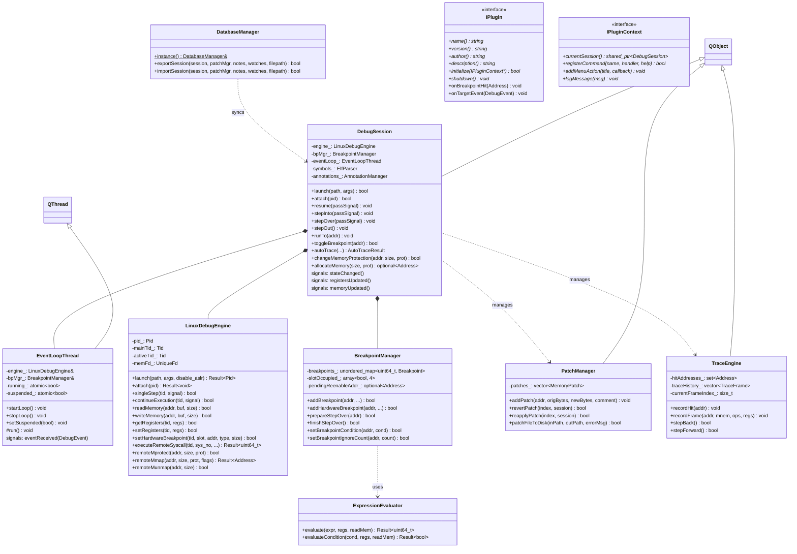
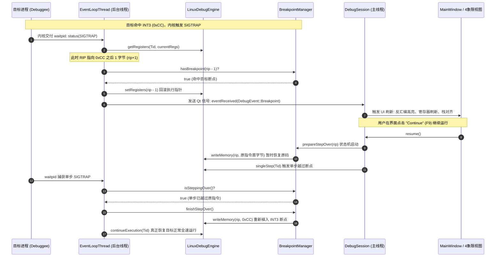
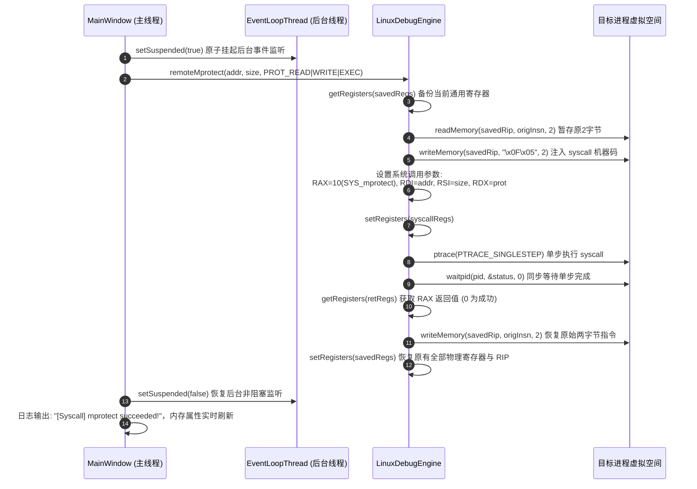

# edb-next 软件架构与工程设计说明书 (Software Design Document)

> **项目名称**：edb-next (Next-Generation Linux Binary Debugger & Reverse Engineering Platform)  
> **文档版本**：v1.0.0 (Release Candidate)  
> **开发语言**：C++20 / 纯 Qt 6.4+ (GCC 13+) / Capstone Engine  
> **面向平台**：Linux x86_64  
> **发布目标**：作为独立、现代化、工业级的开源逆向调试项目发布至 GitHub

---

## 目录

1. [项目愿景与定位 (Project Vision & Positioning)](#1-项目愿景与定位-project-vision--positioning)
   - 1.1 研发背景与行业痛点
   - 1.2 对标竞品与核心破局 (edb-next vs 原版 edb vs x64dbg)
   - 1.3 核心设计原则
2. [软件核心特点与架构亮点 (Key Characteristics & Architectural Highlights)](#2-软件核心特点与架构亮点-key-characteristics--architectural-highlights)
3. [已实现功能全景清单 (Complete Implemented Features Breakdown)](#3-已实现功能全景清单-complete-implemented-features-breakdown)
   - 3.1 核心内核与执行控制引擎
   - 3.2 反汇编与控制流分析引擎
   - 3.3 CPU 寄存器与机器状态管理
   - 3.4 内存管理、多路转储与物理落盘
   - 3.5 运行时堆栈与函数调用链回溯
   - 3.6 堆内存深度解构与 Linux 系统内省
   - 3.7 漏洞挖掘与高级逆向分析工具箱
   - 3.8 逆向工程数据库与会话持久化
   - 3.9 交互式命令行控制台与插件体系
   - 3.10 4 象限工作台与现代化 UI/UX 系统
   - 3.11 DWARF 源码级调试与双向行号映射系统
   - 3.12 嵌入式 Python 3 & Lua 5.4 双自动化脚本引擎系统
   - 3.13 C++ 符号反混淆 (Demangling) 系统
   - 3.14 内存转储区细粒度硬件读写监视点交互与断点单元格高亮
   - 3.15 断点绑定 Python/Lua 脚本自动化动作与微秒级无感打桩系统
   - 3.16 内存页保护断点与隐蔽断点系统 (Page-Guard Breakpoint & Anti-Anti-Debugging)
   - 3.17 动态库加载全自动拦截与热重载系统 (_r_debug Rendezvous & Pending Breakpoints)
   - 3.18 多进程 Follow-Fork 与子进程跟踪系统 (Follow-Fork Mode & Multi-Process Inferior Debugging)
   - 3.19 多线程独立冻结与解冻控制及隔离单步步进 (Thread Freeze / Thaw & Isolated Stepping)
   - 3.20 动态内存特征差分扫描器与多轮数值收敛 (Differential Memory Scanner - CheatEngine style)
   - 3.21 复合数据类型重建与结构体布局可视化 (Type Viewer & Struct Layout Visualizer)
   - 3.22 x64dbg 风格现代化逆向工效与 UI/UX 增强系统 (x64dbg-Style UI/UX & Ergonomics)
4. [未实现功能与待完善规划 (Unimplemented Features & Technical Roadmap)](#4-未实现功能与待完善规划-unimplemented-features--technical-roadmap)
   - 4.1 多 CPU 架构与交叉调试扩展
   - 4.2 高级反反调试深度扩展
   - 4.3 硬件监视点 DR6 状态精准溯源与页保护自动降级
   - 4.4 GDB 远程调试协议 (RSP) 客户端支持
   - 4.5 路线图特性的重要等级与实施优先级评估矩阵
5. [代码结构与模块拓扑关系 (Codebase Structure & Module Architecture)](#5-代码结构与模块拓扑关系-codebase-structure--module-architecture)
   - 5.1 完整源码目录树与职责清单
   - 5.2 软件分层架构图
   - 5.3 核心类继承与接口关系图
   - 5.4 关键业务链路时序图
6. [详细系统设计思路与关键技术方案 (Detailed System Design & Technical Schemes)](#6-详细系统设计思路与关键技术方案-detailed-system-design--technical-schemes)
   - 6.1 异步非阻塞多线程事件模型设计
   - 6.2 断点全生命周期状态机设计
   - 6.3 远程系统调用注入方案 (`executeRemoteSyscall`)
   - 6.4 工业级表达式求值引擎 (`ExpressionEvaluator`)
   - 6.5 ELF 全景解析与虚存-文件映射算法 (`patchFileToDisk`)
   - 6.6 C++20 纯虚契约插件体系设计
   - 6.7 项目工程数据库持久化设计 (`.edb_db`)
7. [编译构建、安装与使用全流程指南 (Build, Installation & User Guide)](#7-编译构建安装与使用全流程指南-build-installation--user-guide)
   - 7.1 系统依赖与开发环境准备
   - 7.2 编译构建指令
   - 7.3 全量自动化测试套件运行
   - 7.4 逆向实战快速上手操作指南
8. [GitHub 独立开源发布与工程规范 (GitHub Release & Engineering Guide)](#8-github-独立开源发布与工程规范-github-release--engineering-guide)

---

## 1. 项目愿景与定位 (Project Vision & Positioning)

### 1.1 研发背景与行业痛点
在二进制逆向工程与动态调试领域，Windows 平台拥有极其成熟且生态繁茂的图形化调试利器——**x64dbg**，其直观的四象限工作流、强大的 CLI 命令行、多标签内存转储与工程持久化数据库深入人心。

反观 Linux 平台，长期处于两极分化的尴尬境地：
1. **GDB / GEF / pwndbg**：命令行交互极度强大，但在大中型复杂逆向分析、基本块控制流拓扑梳理、多路内存连续观察与直观热补丁对比时，纯终端字符界面存在不可避免的视觉疲劳与交互门槛；
2. **原版 edb-debugger**：作为 Linux 平台罕有的经典 Qt 图形化调试器，具有开创性意义。然而随着软件工程的发展，原版存在一系列阻碍生产力的问题：
   - **架构过度碎片化**：核心业务被硬拆分为 22 个小插件，插件间高度耦合，严重依赖全局静态服务查找；
   - **事件循环死锁顽疾**：主线程采用单线程 0ms `QTimer` 轮询 `waitpid`，在高频断点触发或多线程切换时极易引发事件饥饿、界面冻结甚至崩溃；
   - **核心逆向功能缺失**：仅支持单路内存转储（无法并排对比多个数据段）、无法动态绕过只读内存权限（修改内存直接报错）、缺乏一键补丁写回磁盘 ELF 文件的能力、缺乏工程分析成果持久化机制（退出即丢失所有注释与断点），且没有实用的 CLI 交互控制台。

### 1.2 对标竞品与核心破局 (edb-next vs 原版 edb vs x64dbg)
**edb-next** 旨在成为 **Linux 平台下首屈一指的工业级原生二进制图形化调试器**。它基于现代 C++20 与 Qt 5.15+ 进行完全从零的现代架构重构，彻底解决原版稳定性质缺陷，全方位深度对标并吸纳 x64dbg 经受住实战检验的经典操作手感，同时结合 Linux 内核特质打造原生独家杀手级功能。

| 维度 / 功能项 | 原版 edb (Linux) | x64dbg (Windows) | edb-next (现代 Linux 重构) | 核心突破与优势 |
| :--- | :---: | :---: | :---: | :--- |
| **语言与规范** | C++11 混合 C 宏 | C++14/17 | **现代 C++20 标准** | 强类型、RAII、Concepts、智能指针全面治理，零裸指针泄漏 |
| **事件循环并发** | 0ms QTimer 轮询 (易死锁假死) | 复杂同步事件 | **非阻塞 EventLoopThread** | 独立后台线程 `WNOHANG` 监听，Qt 信号槽异步调度，UI 毫秒级流畅响应 |
| **工作台布局** | 单一底部抽屉 (反复切Tab) | 经典四象限布局 | **4-Quadrant 黄金工作流** | 反汇编、寄存器、多路Dump、专有64位栈视图始终同屏四维联动 |
| **内存转储能力** | 单一 Hex Dump | 标配 Dump 1~5 | **4路独立 MultiDumpWidget** | 独立起始地址、滚动游标、历史栈与全域上下文跟随 |
| **只读内存修改** | 报错拒绝写入 | VirtualProtect 模拟 | **原生远程系统调用注入** | 注入 `SYS_mprotect` 原生突破只读页保护；支持 `SYS_mmap` 动态分配注入块 |
| **脱壳补丁落盘** | **无此功能** (仅内存补丁) | 导出 Patched PE | **创新 `patchFileToDisk`** | 解算 `VAddr -> FileOffset`，一键生成脱壳/修补后的物理独立可执行 ELF |
| **项目成果持久化** | 退出全盘丢失 | 标配 `.dd64` 数据库 | **`.edb_db` JSON 项目持久化** | 自动匹配二进制哈希/路径，全量恢复注释、书签、断点参数、监视表与笔记 |
| **命令行交互** | 无交互 CLI | 标配底栏命令行 | **x64dbg 风格 CommandBar** | 内置高频逆向指令、历史回溯、语法解析与插件命令无缝扩展 |
| **Linux 原生堆分析** | 插件支持较旧 | 不支持 Linux 堆 | **原生 Glibc ptmalloc 引擎** | 解析 `malloc_chunk` 链表、标志位 `A\|M\|P`，双击直达堆块内存 |
| **系统调用与信号** | 基础信号传递 | 不适用 | **POSIX 信号矩阵 + 透传** | 1~64 信号拦截/放行矩阵，`Shift+F7/F8/F9` 透传执行 |
| **漏洞利用辅助** | 基础 ROP 插件 | 需第三方插件 | **内置 ROP 工具箱** | 滑动窗口逆向提取 Gadgets，智能分类并一键导出 Python `p64(...)` 脚本 |

### 1.3 核心设计原则
1. **零死锁与永不冻结 (Zero Deadlock & UI Responsiveness)**：底层操作系统调用与等待全部置于后台独立线程，主界面只响应事件通知。
2. **高内聚低耦合 (High Cohesion & Low Coupling)**：核心引擎（`LinuxDebugEngine`）、断点管理（`BreakpointManager`）、解析器（`ElfParser`）与 GUI 彻底分离，核心层可剥离为独立 headless 调试库运行自动化测试。
3. **肌肉记忆完全平迁 (Muscle Memory Compatibility)**：按键映射（F2/F4/F7/F8/F9/Ctrl+*等）、跳转逻辑与查看习惯完全贴合逆向人员最高效的操作直觉。
4. **可逆性与工程可追溯 (Reversibility & Persistence)**：任何内存补丁皆可随时撤销/重做；任何逆向分析沉淀皆可落盘与版本化存储。

---

## 2. 软件核心特点与架构亮点 (Key Characteristics & Architectural Highlights)

### 2.1 前后台完全解耦的异步事件循环模型
原版 edb 最臭名昭著的问题是主 UI 线程利用 0ms 定时器循环调用 `waitpid()`，导致 UI 处理与内核状态查询争夺时间片。edb-next 彻底摒弃该设计：
- **`EventLoopThread` 独立守护**：在单独的 `QThread` 中以非阻塞 `waitpid(-1, &status, __WALL | WNOHANG)` 模式循环轮询；
- **原子状态挂起机制 (`suspended_`)**：当主线程需要发起前台同步系统操作（如注入 `SYS_mprotect` 执行单步探测）时，原子挂起后台循环，杜绝事件捕获竞态，确保前后台零死锁。

### 2.2 目标地址空间远程系统调用原子注入 (`executeRemoteSyscall`)
传统 Linux 调试器在遇到只读内存（如 `.rodata` 或无写权限的 `.text` 段）时，无法写入补丁，且无法在被调试目标进程中申请新的堆内存。edb-next 实现了创新的 **Remote Syscall Injection**：
- 暂存当前线程全部寄存器上下文与指令指针；
- 在当前 RIP 处临时覆写 `0x0F 0x05` (`syscall`) 指令；
- 将系统调用号及最多 6 个参数装入 `RAX`, `RDI`, `RSI`, `RDX`, `R10`, `R8`, `R9`；
- 发起 `PTRACE_SINGLESTEP` 驱动内核执行系统调用；
- 捕获单步完成信号，从 `RAX` 提取内核返回值；
- 恢复被覆写的原始指令，并原子还原寄存器上下文。  
由此，调试器获得了在目标地址空间任意执行 `SYS_mprotect`（修改虚拟页保护）、`SYS_mmap`（动态分配独立可执行内存块）、`SYS_munmap`（内存释放）的强大特权。

### 2.3 物理磁盘 ELF 补丁落盘引擎 (`patchFileToDisk`)
大部分逆向人员在调试器中完成破解（如将 `jz` 改为 `nop` 或 `jmp`）后，不得不打开外部十六进制编辑器二次寻找文件偏移修补。edb-next 原生内置 **ELF 物理磁盘落盘算法**：
- `ElfParser` 解析目标 ELF 的 `Program Headers` (`PT_LOAD`) 与 `Section Headers`；
- 根据已记录的内存补丁虚拟地址 $V$，匹配对应包含该地址的加载段，利用公式解算物理文件偏移：
  $$\text{FileOffset} = V - \text{Segment.p\_vaddr} + \text{Segment.p\_offset}$$
- 支持一键将整套补丁写回磁盘生成独立的修改版 ELF 二进制，并赋予可执行权限，真正实现从动态逆向到静态落地的一站式闭环。

### 2.4 逆向工程数据库自动持久化 (`.edb_db`)
逆向工作是一项耗时极大的知识密集型任务。edb-next 设计了标准化 JSON 逆向数据库架构：
- 记录二进制文件的绝对路径、哈希指纹、用户逆向随笔草稿（Notes）；
- 完整沉淀全量行注释（Comments）、自定义用户标签（Labels，醒目徽章 `🏷` 且全局参与符号解析）、书签索引（Bookmarks）、断点配置（含触发条件、命中间隔、仅日志格式串）、监视表达式列表（Watches）与内存补丁项（Patches）；
- **全自动无感加载**：当用户在主窗口再次打开相同的二进制程序时，系统自动在对应目录下探寻同名 `.edb_db` 文件并瞬间恢复全量逆向成果。

### 2.5 经典四象限 (4-Quadrant) 黄金调试工作台
彻底解决传统单抽屉界面频繁在内存、栈和反汇编之间来回切换的割裂感：
- **左上象限**：`DisassemblyView`，集成实时 Capstone 语法高亮、指令前缀折叠、操作数有效地址预览、分支跳转色彩线条；
- **右上象限**：`RegisterView`，16 大 64 位通用寄存器（整齐对齐，变动标红）、EFLAGS 翡翠绿交互翻转徽章条、SSE/AVX 向量组；
- **左下象限**：`MultiDumpWidget`（Dump 1 ~ Dump 4 独立内存标签页），搭配 18 大按需展开的高级分析抽屉；
- **右下象限**：**专有独立 64 位调用栈 (`StackView`)**，QWORD 展开、相对 RSP/RBP 偏移动态计算、栈指针有效性探测与字符串/函数符号深度自动解引用。

---

## 3. 已实现功能全景清单 (Complete Implemented Features Breakdown)

本章节详尽列出当前 `edb-next` 已经实装、并通过全量单元测试与回归验证的所有核心功能。

### 3.1 核心内核与执行控制引擎
1. **进程生命周期管控**：
   - **Launch**：通过 `fork()` + `PTRACE_TRACEME` 派生子进程，调用 `personality(ADDR_NO_RANDOMIZE)` 支持原生一键禁用 ASLR；
   - **Attach**：支持通过 PID 挂钩已存在的 Linux 进程，安全拦截并接管目标；
   - **Detach / Terminate / Restart**：优雅脱钩释放、强行销毁目标或使用原有参数即刻重启调试会话（`Ctrl+F2`）。
2. **多模式执行控制**：
   - **Continue (F9)**：继续执行目标程序；
   - **Single Step Into (F7)**：单步步入当前指令；
   - **Single Step Over (F8)**：单步步过（识别 `CALL` 指令自动在下一行下临时断点）；
   - **Step Out (Shift+F11)**：安全提取 Frame #1 返回地址，自动下断并运行至跳出当前函数；
   - **Run to Selection (F4)**：在光标所在行打下一次性临时断点并继续运行，命中即销；
   - **Pause**：前台一键异步挂起目标执行。
3. **断点控制与状态机**：
   - **软件断点 (INT3)**：向目标代码注入 `0xCC` 机器码，命中时内核回退 RIP，恢复原始操作码，激活 `PTRACE_SINGLESTEP` 越过断点，随后重新植入 `0xCC` 恢复断点状态；
   - **DR0~DR7 硬件断点**：自动分配 4 个硬件调试寄存器，支持执行断点（Execute）、写监视点（Write 1/2/4/8 字节）与读写监视点（Read/Write 1/2/4/8 字节）；
   - **条件断点 (Conditional Breakpoint)**：挂接递归下降表达式求值引擎，支持寄存器（`rdi == 7`）、内存指针解引用（`[rbp-8] > 0`）与逻辑关系运算；
   - **命中间隔 (Ignore Count)**：支持配置忽略前 $N$ 次命中，专门用于调试大型循环体；
   - **仅日志断点 (Log Only / Trace Points)**：命中时不阻断目标运行，仅将格式化寄存器/表达式求值结果打印至系统调试日志。
4. **POSIX 信号管理与透传矩阵**：
   - 偏好设置中提供 1~64 号标准与实时 POSIX 信号（SIGSEGV, SIGTRAP, SIGINT 等）的拦截与忽略策略矩阵；
   - 菜单栏提供 `Shift+F7` (Step Into Pass Signal)、`Shift+F8` (Step Over Pass Signal)、`Shift+F9` (Run Pass Signal) 三大透传动作。
5. **远程系统调用注入与目标内存管理**：
   - `remoteMprotect` (`SYS_mprotect`)：就地动态更改任意虚拟内存页的权限（RWX / RX / RW / RO / None）；
   - `remoteMmap` (`SYS_mmap`)：在目标进程地址空间中动态匿名分配任意大小的独立内存页；
   - `remoteMunmap` (`SYS_munmap`)：动态释放目标进程中的匿名内存块；
   - `setInstructionPointer` (Set RIP / `Ctrl+*`)：强制改变指令指针并写回物理寄存器。
6. **多线程枚举与无锁切换**：
   - 实时遍历 `/proc/<pid>/task/` 任务树，查询每条线程的运行状态（Running, Sleeping, Traced）与独立寄存器上下文；
   - 工作台 Tab 10 支持双击或按钮即时切换活动 TID，底层安全代理 `PTRACE_EVENT_CLONE` 与新线程事件。

### 3.2 反汇编与控制流分析引擎
1. **Capstone x86_64 高性能反汇编**：
   - 64 位指令集语法着色、指令操作码十六进制展示、Intel 规范汇编语法输出；
   - 自动解析 `[rip + disp]` 相对寻址，计算绝对物理目标地址并匹配全局符号。
2. **EFLAGS 动态分支预测推演**：
   - `InstructionInspector` 解析基址变址复合内存寻址（`base + index*scale + disp`）；
   - 根据当前实时标志位（ZF, SF, OF, CF）动态推算条件跳转是否发生（`[JUMP TAKEN]` / `[JUMP NOT TAKEN]`），常驻在主工作台底部状态条。
3. **交互式基本块控制流图 (CFGGraphView - Tab 14)**：
   - 自动切分函数基本块（Basic Blocks），分析无条件跳转、条件跳转（True 分支）与 Fall-through（False 直行分支）；
   - 采用有向图层级分层拓扑渲染，绿色标识条件满足跳转，红色标识条件不满足直行，蓝色标识无条件跳转；
   - 支持鼠标拖拽平移、滚轮无级缩放、双击节点直接联动反汇编定位。
4. **分支跟随与导航历史堆栈 (Follow Branch & Navigation History)**：
   - 快捷键 **Enter**：自动解析当前指令分支目标（`CALL`, `JMP`, `Jcc`），将当前地址压入导航历史栈并瞬时跳转至目标；
   - 快捷键 **Esc / Backspace / Alt+Left**：瞬时回退至上一个逆向分析点，**Alt+Right** 前进，逆向函数调用极为流畅。
5. **代码交叉引用检索器 (CodeXRefFinder & XRefDialog)**：
   - 快捷键 **X**：极速扫描目标代码段中所有指向当前光标地址的 `CALL`、`JMP`、`Jcc` 与 `LEA [rip + disp]` 引用，双击列表直达调用点。
6. **纯内存超高速内联汇编器 (Keystone Assembler)**：
   - 快捷键 **Space**：集成 Keystone Engine（LLVM MC 后端），单条指令纯内存微秒级汇编（1000条压测仅需 1.2ms，提速逾 10,000 倍），原生支持基址与相对跳转重定位；
   - 保留 GNU `as` + `ld` + `objcopy` 外部工具链作为透明回退（Fallback）机制；
   - 智能计算替换字节差值，支持一键自动使用 `0x90 (NOP)` 补齐指令长度，保护后续汇编指令对齐。
7. **高级操作码与指令序列搜寻引擎 (OpcodeSearcher - Tab 19)**：
   - 高速扫描目标全部可执行内存段；
   - 预置高频漏洞挖掘模式：`JMP <reg>`、`CALL <reg>`、`PUSH <reg>; RET`、`POP <reg>; RET`、`Syscall / Interrupt`，并支持用户自定义指令子串与正则过滤。

### 3.3 CPU 寄存器与机器状态管理
1. **通用寄存器表 (GPRs)**：
   - 呈现 16 大通用寄存器十六进制值与十进制数值，数值变动翡翠红高亮；
   - **智能解引用与符号推导**：自动匹配就近 ELF 符号偏移（`<main+0x10>`）、栈指针标注（`=> [RSP]`）、探测 ASCII 字符串预览（`"Hello"`）与二级指针链（`-> 0x5555... <target>`）。
2. **EFLAGS 交互翻转条**：
   - 顶部提供 `CF`, `PF`, `AF`, `ZF`, `SF`, `TF`, `IF`, `DF`, `OF` 徽章按钮；
   - 翡翠绿（置位）与暗灰（清零）实时色彩反馈，鼠标左键单击即时物理反转标志位并写回寄存器。
3. **SSE / AVX XMM 向量寄存器组**：
   - 内核驱动层接入 `PTRACE_GETFPREGS` 与 `NT_FPREGSET`；
   - 专属 FPU/SSE 面板同时呈现 128 位十六进制、4 组 Float32、2 组 Double64 浮点值，支持双击就地修改。
4. **全域右键上下文菜单联动**：
   - 寄存器表右键支持 "Follow in Disassembly"、"Follow in Dump"、"Modify Value"、"Zero Register"（一键清零）、"Toggle Value"（按位取反）与快捷复制。
5. **CPU 机器状态全景快照生成器 (StateDumper - `Ctrl+D`)**：
   - 对标原版 edb 的 `DumpState` 插件，一键生成包含 PID、16 GPRs 对齐排布、9 EFLAGS 逐位展开、RIP 上下文指令窗口与运行时栈顶 8 组 QWORD 的精细快照报告，自动复制至系统剪贴板。

### 3.4 内存管理、多路转储与物理落盘
1. **4路独立 MultiDumpWidget (Dump 1 ~ Dump 4)**：
   - 完全对齐 x64dbg 标配体验，提供 4 个独立内存转储标签页，各页具备独立的基地址、滚动位置与历史记录；
   - 外部联动信号（反汇编、寄存器或栈视图的 "Follow in Dump"）智能路由至当前活动 Dump 页。
2. **内存十六进制就地热补丁**：
   - 快捷键 **Ctrl+E**：支持输入任意十六进制机器码并直接写入内存页；提供一键 NOP 填充与零填充。
3. **集中补丁管理器 (PatchManager & PatchManagerDialog - `Ctrl+P`)**：
   - 集中列出当前会话的所有修改点、原字节与修改后字节对照，支持单个或批量撤销/重做。
4. **物理磁盘 ELF 文件落盘 (`patchFileToDisk`)**：
   - 基于 ELF 加载段自动将虚拟地址映射为物理文件偏移，一键输出脱壳或打好补丁的可执行文件。
5. **内存段原始二进制导出 (`.bin`)**：
   - 内存区域表右键一键将目标进程任意内存段完整导出为磁盘原始二进制文件。
6. **带 `??` 通配符的特征码内存搜索 (PatternSearcher)**：
   - 支持形如 `f3 0f ?? fa` 的通配符掩码搜寻，极速定位可变特征代码。
7. **内存字符串深度扫描 (StringScanner)**：
   - 自动遍历进程可读内存段提取 ASCII 字符串（$\ge 4$ 字符），并自动反向索引代码段中的引用位置。

### 3.5 运行时堆栈与函数调用链回溯
1. **专有 64 位机器字栈视图 (Dedicated StackView)**：
   - 独立常驻于右下象限，以 8 字节 QWORD 呈现：
     - **Address 列**：青色展示物理虚拟栈地址；
     - **Value 列**：高亮呈现 64 位数值，双击智能路由（代码指针跳反汇编，数据指针跳 Dump）；
     - **Offset 列**：动态计算相对当前 RSP/RBP 偏移（`=> RSP`、`+0x08`、`[RBP]`、`[RBP-0x10]`）；
     - **Symbol / Comment 列**：自动绑定函数符号、偏移及内存字符串预览。
   - 顶部快捷操作条：`[RSP]` (回栈顶)、`[RBP]` (跳基址)、`[Go to...]`、快捷键 `Shift+S` (展开/折叠)。
2. **DWARF CFI / RBP 栈帧混合深度回溯引擎 (CallStackUnwinder & CallStackView - Tab 3)**：
   - 优先通过 `libdwfl` 状态机深度解析 `.eh_frame` / `.debug_frame` CFI，彻底突破现代编译器 `-fomit-frame-pointer` 造成的栈帧截断，平滑穿透 `libc.so` 等系统库调用；
   - 内置 RBP 链校验（8字节对齐、严格地址递增与内存可读性）作为安全回退机制；
   - 深度回溯 Frame #0 ~ Frame #N，符号化展示调用者地址，双击直接联动反汇编与源码。

### 3.6 堆内存深度解构与 Linux 系统内省
1. **Glibc ptmalloc 堆内存深度剖析器 (HeapAnalyzer & HeapView - Tab 9)**：
   - 自动检索虚拟内存段中的 `[heap]` 区域；
   - 沿着 `malloc_chunk` 结构体链条解析 `prev_size`、`size` 及标志位（`A|M|P`），精准识别 Allocated 块、Free 块与 Top Chunk；
   - 双击堆块即刻在内存转储区定位至用户数据区。
2. **ELF 文件结构全景视图 (BinaryInfoView - Tab 17)**：
   - 深度解析 64 位 ELF 核心文件头；
   - 解析 `Program Headers (Segments)`（虚拟/物理地址、段权限、对齐）与完整 `Section Headers`（`.text`, `.rodata`, `.data`, `.bss`, `.plt`, `.got`）；
   - 解析 `DT_NEEDED` 动态依赖共享库列表（如 `libc.so.6`, `libpthread.so.0`）；
   - 双击节区或段直接联动反汇编（代码段）或十六进制 Dump（数据段）。
3. **跨模块共享库 API 外呼分析器 (IntermodularCallsView - Tab 18)**：
   - 深度扫描主程序代码段对外部共享库 API（PLT/GOT）的调用（`puts`, `printf`, `malloc`, `free` 等）；
   - 支持按 API 名称模糊过滤，双击直达调用现场。
4. **进程环境与文件描述符句柄追踪 (ProcessPropertiesView - Tab 8)**：
   - 深度读取 `/proc/<pid>/cmdline`、`/proc/<pid>/environ`、`/proc/<pid>/status`；
   - 遍历 `/proc/<pid>/fd/` 并解引用软链接，智能识别普通文件、网络套接字 (Socket)、管道 (Pipe) 与终端 (PTY)。

### 3.7 漏洞挖掘与高级逆向分析工具箱
1. **ROP Gadget 扫描与漏洞利用生成器 (ROPScanner & ROPToolView - Tab 11)**：
   - 反向滑动窗口扫描可执行段，提取以 `ret`, `syscall`, `int 0x80` 结尾的指令序列；
   - 智能分类归档：`StackPivot`, `Syscall`, `MemoryWrite`, `Arithmetic`, `General`；
   - 支持一键生成 Python 漏洞利用 Payload（`p64(...)` 格式）并复制至剪贴板。
2. **代码执行追踪与时间旅行回溯 (TraceEngine & TraceView - Tab 13)**：
   - **Hit Trace (代码覆盖率)**：执行过程中实时高亮已覆盖指令地址，统计覆盖总数；
   - **Run Trace (指令执行历史记录)**：单步追踪记录执行流，自动对比前后两帧寄存器差异并标红变动；
   - **时间旅行单帧导航**：支持 `< Step Back` 与 `Step Forward >`，在历史记录中自由回溯，实时联动寄存器与反汇编光标；
   - **Auto Trace (自动步进)**：支持设定最大步数限制与条件表达式中断。
3. **动态监视表达式窗口 (WatchView - Tab 12)**：
   - 支持常驻监视用户自定义的表达式（如 `rax`、`[rbp-8]`、`rax + rbx`）；
   - 单步调试过程中自动重算求值，数值发生变动时高亮提示。
4. **逆向草稿随手记 (NotesView - Tab 15)**：
   - 集成 Monospace 文本编辑器；
   - 提供一键插入当前 RIP 地址、插入时间戳、导出为 `.md` 文档及同步至项目数据库功能。

### 3.8 逆向工程数据库与会话持久化
1. **DatabaseManager 核心机制**：
   - 采用标准 JSON 结构持久化所有注释、书签、断点（含高级属性）、内存补丁、监视表达式与随笔笔记；
   - 支持快捷键 `Ctrl+S` 手动保存与 `Ctrl+Shift+S` 另存为；
   - 重新打开相同目标程序时自动匹配同名 `.edb_db` 数据库文件，无感恢复全量分析环境。

### 3.9 交互式命令行控制台与插件体系
1. **底部常驻极客命令行控制台 (CommandBarView)**：
   - 常驻主界面底部，支持上下箭头历史记录回溯与自动命令分发；
   - 内置指令集：
     - `bp [addr|sym]`：下软件断点
     - `bph [addr]`：下硬件执行断点
     - `bc [addr]` / `bd [addr]` / `be [addr]`：清除 / 禁用 / 启用断点
     - `r [reg] [val]`：修改通用寄存器数值
     - `d [addr]`：在当前 Dump 标签页跳转至指定地址
     - `u [addr]`：在反汇编视图跳转至指定地址
     - `step` / `stepo` / `ret` / `run`：单步步入 / 单步步过 / 跳出 / 运行
     - `eval [expr]`：求值表达式并打印结果
     - `mprotect [addr] [size] [prot]`：动态修改目标内存权限
     - `alloc [size] [prot]`：动态分配目标内存
     - `dumpstate`：导出 CPU 状态快照
     - `help`：列出当前全部内置及插件扩展指令。
2. **现代化 C++20 解耦插件体系**：
   - 纯虚接口契约 `IPlugin` 与能力网关 `IPluginContext`；
   - `PluginManager` 基于 `QPluginLoader` 动态扫描并装载 `.so` 动态库；
   - 插件可向宿主注入主菜单栏项、注册 CLI 命令行扩展、挂接断点拦截钩子与生命周期事件；
   - 提供工业级参考插件工程 `SamplePlugin`（输出 `sample_plugin.so`）。

### 3.10 4 象限工作台与现代化 UI/UX 系统
1. **现代暗黑极客主题 (Dark Geek QSS)**：
   - 专为长周期逆向分析定制的高对比度暗黑样式：微圆角标签页、科技蓝 2px 激活指示条、高对比表头与极简滚动条。
2. **高对比度断点与执行指针指示器**：
   - 当前执行行 (RIP)：深青高亮背景与翠绿粗体指示箭头 `➔`；
   - 软件/硬件断点行：深红背景与红色圆点标识；
   - 断点兼当前 RIP 行：复合洋红强调色。
3. **全局快捷键习惯对齐**：
   - 支持快速窗口切换：`Alt+C` (CPU/反汇编)、`Alt+D` (Dump)、`Alt+K` (调用栈)、`Alt+B` (断点)、`Alt+M` (内存段)、`Alt+E` (符号)、`Alt+L` (日志)。
4. **Wayland 与多分辨率窗口自适应优化**：
   - 彻底解决 GNOME Mutter / Wayland 环境下最大化限制问题，最小约束宽度精简至 358px，在高分屏及笔记本屏幕上自由伸缩、秒级最大化。

### 3.11 DWARF 源码级调试与双向行号映射系统
1. **libdw 原生接入与行号映射**：
   - 接入 `libdw` 并封装 `core/DwarfParser` 与 `core/SourceFileManager`，深度解析 ELF `.debug_info`、`.debug_line` 与 `.debug_str` 节区；
   - 提取 Compilation Units (CU) 及其 Producer、编译目录与源文件清单，构建 `Address <-> (SourceFile, Line, Column)` 高性能双向哈希索引树，支持极速反向查找；
   - 自动解析调试二进制中的源码绝对路径与相对路径，若源码文件存在则以只读模式载入行缓存，若不存在则提供优雅退化与只读保护；
2. **源码反汇编混合渲染 (`DisassemblyView`)**：
   - 当目标程序携带 `-g` 编译时，支持 `Ctrl+Shift+S` 快捷切换纯汇编与混合排版模式；
   - 指令上方以暗黑青绿横幅精确嵌入展示对应的 C/C++ 原始源码语句与行号，极大加速复杂业务逻辑审计；
3. **独立源码文件浏览器 (`SourceView`, `Alt+S`)**：
   - 包含多源文件下拉切换、行号指示栏、当前执行位置青蓝色箭头（`➔`）与断点红色圆点（`●`）；
   - 支持源码行双击切换断点，并在调试引擎中原生实现 `stepSourceOver`（单步步过源码行）与 `stepSourceInto`（单步步入源码行）。

### 3.12 嵌入式 Python 3 & Lua 5.4 双自动化脚本引擎系统
1. **统一双引擎架构 (`IScriptEngine` & `ScriptEngineManager`)**：
   - 定义抽象基类 `IScriptEngine` 与路由管理器 `core/ScriptEngineManager`，支持按语言名称（`"python"` / `"lua"`）或脚本后缀（`.py` / `.lua`）自动分发执行；
   - 维护与 `DebugSession` 的生命周期同步，保证多线程执行环境下的线程安全与状态一致；
2. **Python 3 原生 C-API 嵌入**：
   - 无缝内嵌 CPython 3 运行时并注册原生 `edb` 内置模块，提供完整的寄存器读写（`get_regs`, `get_reg`, `set_reg`）、内存读写（`read_memory`, `write_memory`）、断点管理（`set_breakpoint`, `remove_breakpoint`）、单步及源码控制（`step_into`, `step_over`, `step_source`, `resume`, `pause`）、表达式求值（`eval`）以及进程状态查询；
   - 自动重定向 `sys.stdout` 和 `sys.stderr` 捕获异常 Traceback 与输出，实时打印至控制台；
3. **Lua 5.4 轻量级极速嵌入**：
   - 内嵌 Lua 5.4 解释器并注入全局 `edb` 模块表，实现与 Python 对应的完整对称 API；
   - 重写 `print()` 捕获机制，专为高频断点命中、微秒级条件求值与无 GIL 瓶颈的高性能自动化场景打造；
4. **现代化交互式脚本控制台 (`ui/ScriptConsoleView`, `Alt+P`)**：
   - 集成在底部工作区抽屉，具备语言切换（`Python 3` / `Lua 5.4`）、脚本文件一键运行（`▶ Run File...`）、控制台清空、历史命令上下箭头回溯及暗黑极客高对比度语法高亮渲染；
5. **全局 CommandBar 快速命令与自动化测试**：
   - 底部命令行 CommandBar 原生支持 `py <code...>` 与 `lua <code...>` 单行执行；
   - 配套自动化单元测试集 `tests/test_scripting.cpp`，覆盖率 100%。

### 3.13 C++ 符号反混淆 (Demangling) 系统
1. **Itanium ABI Demangler 原生集成**：
   - 在 `core/ElfParser` 中实现 `ElfParser::demangle(const std::string&)`，基于 GNU `<cxxabi.h>` 的 `abi::__cxa_demangle` 对 Mangled 符号（形如 `_Z13calculate_fibi`、`_ZNSt7__cxx1112basic_string...`）进行运行时极速反混淆；
   - 零额外第三方依赖，针对纯 C 语言符号或未混淆字符串提供零拷贝原样安全退化；
2. **全流程全景可读化注入**：
   - 扩展 `SymbolInfo` 数据模型，同时持有 `mangledName` 与 `demangledName`，并暴露 `displayName()` 接口；
   - 符号表反向查找树（`nameToAddress_`）支持双名称双向索引检索；
   - 调用栈栈帧回溯 (`CallStackUnwinder`)、反汇编行内符号指示、寄存器智能解引用 (`RegisterView`) 与栈内存注释 (`StackView`) 全线统一优先呈现自然易读的 C++ 函数签名与方法名；
3. **全局符号浏览器 (`SymbolViewer`) 交互增强**：
   - 表格直观呈现反混淆符号名，浮动 Tooltip 保留原始 Mangled 字符串以便逆向比对；
   - 顶部搜索框支持 Mangled 与 Demangled 双向模糊匹配过滤。

### 3.14 内存转储区细粒度硬件读写监视点交互与断点单元格高亮
1. **Hex Dump 单元格右键交互闭环**：
   - 在 `MemoryHexView` 右键菜单中新增 "Breakpoint" 子菜单；
   - 针对当前选中的内存单元格虚拟地址，支持一键设置：
     - **Set Hardware Write Watchpoint**：1 字节、2 字节、4 字节、8 字节硬件写监视点；
     - **Set Hardware Read/Write Watchpoint**：1 字节、2 字节、4 字节、8 字节硬件读写监视点；
     - **Set Hardware Execute Breakpoint**：硬件执行断点；
     - **Toggle / Remove Breakpoint**：传统 0xCC 软件断点切换与移除；
2. **断点单元格醒目高亮与悬浮 Tooltip 状态指示**：
   - 刷新时自动比对当前单元格地址与 `BreakpointManager` 中激活的软硬件断点；
   - 存在断点的单元格自动以深红底色 (`QColor(160, 40, 40, 160)`) 与高亮白字醒目呈现，鼠标悬浮自动显示 `Breakpoint active at 0x...` 提示信息；
   - 保留未断点单元格原有的 0 字节暗灰、可打印字符亮灰及非可打印字符暗金十六进制语法高亮。

### 3.15 断点绑定 Python/Lua 脚本自动化动作与微秒级无感打桩系统
1. **断点动作脚本引擎打通**：
   - 扩充 `Breakpoint` 模型，支持挂载自定义 `scriptCode` 与 `scriptLanguage`（`"python"` / `"lua"`）；
   - 在 `core/IScriptEngine` 中规范 `executeHook(const std::string& code)` 纯虚接口：
     - **Python 3**：运行时自动将用户代码封装进 `def __edb_bp_hook__(): ...` 保护作用域，若显式 `return False` 则标记放行；异常时捕获 Traceback 并自动转储；
     - **Lua 5.4**：运行时自动将用户代码编译为局部调用闭包，若显式 `return false` 则标记放行；
2. **微秒级无感知动态打桩 (Silent Dynamic Hooking)**：
   - 断点命中时，引擎内部直接交给 `ScriptEngineManager` 对应语言引擎执行；
   - 脚本中可自由调用内置 `edb` 模块的全部 API（如 `edb.get_reg`, `edb.set_reg`, `edb.read_memory`, `edb.write_memory`, `edb.log` 等）；
   - 执行完成后自动同步刷新寄存器状态；若脚本返回 `false`（无感放行），则状态机自动单步并继续全速推进（`prepareStepOver` -> `singleStep` -> `finishStepOver` -> `continueExecution`），**0 界面卡顿、0 弹窗打扰**，完美胜任高频解密、解包转储与数据篡改；
   - 若脚本返回 `true`、未返回或抛出异常，则正常暂停目标并更新 GUI；
3. **断点管理器 (`BreakpointManagerView`) 交互闭环**：
   - 表格新增专有第 8 列 `"Script Action"`，直观呈现脚本语言与行数统计（如 `[PYTHON] 3 line(s)` / `[LUA] 1 line(s)`），悬浮 Tooltip 呈现完整代码；
   - 顶部提供 **"Edit Script Action..."** 按钮，支持在表格内双击第 8 列或右键直达编辑弹窗；弹窗内置语言切换、等宽编辑器与清空重置；
4. **工程数据库持久化 (`.edb_db`)**：
   - `DatabaseManager` 完整序列化/反序列化每个断点的 `script_code` 与 `script_lang`，重启调试自动还原。

---

### 3.16 内存页保护断点与隐蔽断点系统 (Page-Guard Breakpoint & Anti-Anti-Debugging)

为了彻底攻克 Linux 平台两大调试痛点——x86_64 硬件调试寄存器仅 4 个（DR0~DR3）的物理槽位限制，以及面对加固壳或 CTF 混淆题目的代码段校验和（CRC32/Hash）自检测反调试问题，`edb-next` 打造了全自动化的内存页保护断点系统：

1. **核心页保护机制 (Page-Guard Architecture)**：
   - 抽象独立的 `PageGuardManager` 负责管理虚拟内存页（4KB 对齐）保护权限；
   - 支持三种细粒度访问监视策略：
     - **NoAccess (`PROT_NONE`)**：全面拦截读、写与执行；
     - **ReadOnly (`PROT_READ`)**：拦截写操作（软写监视点），允许正常的内存读取与指令执行；
     - **ExecuteOnly (`PROT_EXEC`)**：拦截读写操作，允许正常指令执行；
   - **反反调试隐匿执行断点 (Stealth Execution Breakpoint)**：对代码段设置 `ReadOnly` 或 `NoAccess`，内存中保持真实原版机器码（**零 0xCC 注入**）。当目标自校验函数扫描读取 `.text` 校验和时，页面放行读取，绝不触发篡改警报；当 CPU EIP/RIP 试图执行受控指令时，立即触发内核异常进入调试器。
2. **SIGSEGV 信号捕获与微秒级单步状态机**：
   - `LinuxDebugEngine::getSigInfo()` 通过 `PTRACE_GETSIGINFO` 读取 `si_addr`；
   - 若 `si_addr` 属于受监控页面：
     - **页内假阳性访问透明放行 (False-Positive Page Touch)**：若目标访问的是同一 4KB 页面上的其他无关变量，调试器在内核级微秒内执行“临时撤保 -> 单步一条指令 -> 恢复页保 -> 继续全速运行”，UI 与用户毫无察觉；
     - **真断点命中 (True Breakpoint Hit)**：命中用户关注的变量或指令时，挂起 UI 并标红指示；用户继续运行或单步时，状态机自动确保执行越过该指令后即刻重新设保。
3. **HexDump 视图交互与极客 CLI 集成**：
   - `MemoryHexView` 单元格右键提供 Page-Guard 一键部署（NoAccess、ReadOnly、ExecuteOnly 与自定义字节范围）；
   - 处于 Page-Guard 监视范围内的单元格以金琥珀色背景（`QColor(180, 110, 20, 160)`）醒目高亮；
   - 底栏 CommandBar 提供 `pageguard`（别名 `guard`）、`unpageguard`（别名 `unguard`）以及 `pageguards`（`guards`）全套指令。
4. **工程数据库 (.edb_db) 持久化**：
   - `DatabaseManager` 将受控页保护断点的地址、跨度、权限策略完整写入 JSON 逆向项目工程。

---

### 3.17 动态库加载全自动拦截与热重载系统 (_r_debug Rendezvous & Pending Breakpoints)

在现代 Linux 逆向工程、大型插件系统以及 CTF/加固防护分析中，目标通过 `dlopen()` / `dlsym()` 运行时动态装载共享库（`.so`）已是标配。若调试器仅在启动之初静态解析符号，一旦目标动态拉起新模块，将出现“符号无法识别、断点无法提前下达、新库源码无法单步”等严重脱节问题。`edb-next` 深度接入 Linux glibc 动态链接器内部 Rendezvous 协议，构建了全自动动态库拦截热重载与待决断点系统：

1. **Linux glibc `_r_debug` Rendezvous 协议双轨发现与内部挂钩**：
   - Linux ELF 动态链接器（`ld-linux.so`）在装载目标时，会在其进程空间维护全局单例结构体 `struct r_debug`（64 位系统下严格匹配 `TargetRDebug64` 内存布局），包含加载状态 `r_state`（`RT_CONSISTENT`, `RT_ADD`, `RT_DELETE`）、动态库双向链表头 `r_map`（`struct link_map`）以及事件陷阱函数指针 `r_brk`（指向内部函数 `_dl_debug_state`）；
   - **双轨鲁棒定位机制**：
     - **首选轨**：直接从目标 ELF 主执行文件的 `PT_DYNAMIC` 段检索 `DT_DEBUG` 条目，提取其指向的 `_r_debug` 绝对虚拟地址；
     - **备选轨**：若目标加固壳在早期未写入 `DT_DEBUG`，`RendezvousManager` 自动检索 `/proc/<pid>/maps` 中 `ld-linux.so` 的运行时映射基址，并从其 ELF `.dynsym` 符号表提取 `_dl_debug_state` 与 `_r_debug`；
   - 在 `r_brk` 地址安装不可见的调试器内部陷阱断点（`is_internal = true`），既不占用用户硬件断点槽位，亦不在断点管理表格中产生视觉干扰。

2. **动态库差分扫描与跨子系统热合流**：
   - 目标命中 `_dl_debug_state` 时，调试引擎读取 `_r_debug.r_state`。在动态链接器完成映射达到 `RT_CONSISTENT` 一致性瞬态时，立即触发 `detectChanges()` 差分算法深度遍历 `link_map` 单向链表（提取新模块基址 `l_addr`、库名、绝对路径 `l_name` 与动态段指针 `l_ld`）；
   - **符号表热合并 (`ElfParser::addSharedLibrary`)**：解析新增 `.so` 的 `.symtab` 与 `.dynsym`，叠加动态重定位基址 `l_addr` 并应用 C++ Demangle，将导出符号、函数与全局变量无缝合并至主会话符号索引表并重建二分与哈希索引；
   - **DWARF 源码映射热扩展 (`DwarfParser::addModule`)**：自动为新增 `.so` 挂载 DWARF 编译单元，确保跨动态库的源码级单步跟踪与反汇编混合显示即刻生效；
   - **平滑事件控制与透明越过**：默认模式下，调试器在数微秒内完成差分热重载后自动单步越过陷阱断点并继续全速运行，用户无感知；用户亦可通过 `catch load` / `catch dlopen` 开启加载中断模式，在模块装载瞬间自动暂停目标以便分析。

3. **延迟待决断点 (Pending Breakpoints)**：
   - 针对尚未被目标加载的动态库中的符号（例如插件中的 `calculate_magic`），允许逆向人员提前声明待决断点（CLI 命令 `bpp <symbol>`，或在 `bp <symbol>` 无法解析时根据用户提示自动转入）；
   - `BreakpointManager` 与 `BreakpointManagerView` 将其标注为 `[Pending]` 青色指示与琥珀色待决状态；
   - 一旦 Rendezvous 机制检测到对应 `.so` 装载且符号解析成功，调试器自动将其无缝提升并绑定为真实物理断点（写入 `0xCC` 软断点或硬件槽位），并在日志控制台输出 `[Pending BP] Resolved '<symbol>' -> 0x...`，实现 100% 精准拦截！

4. **可视化与极客交互**：
   - `BinaryInfoView`（Tab 17）新增第 5 个专属标签页：**"Loaded Shared Libraries (`_r_debug`)"**，以表格实时展现当前进程所有已装载共享库的基地址、库名、文件系统路径与动态段信息，支持双击任意行直达反汇编与内存转储；
   - CommandBar CLI 增加 `modules` / `libs` / `solist` 快速输出已加载库，`catch load` / `catch dlopen` 随时开关加载中断。

---

### 3.18 多进程 Follow-Fork 与子进程跟踪系统 (Follow-Fork Mode & Multi-Process Inferior Debugging)

在现代 Linux 系统编程、网络后端服务（如 Nginx、PostgreSQL等多进程架构）、分布式通信应用以及安全竞赛（CTF Pwn 多进程沙箱与子进程提权漏洞）中，目标进程通过 `fork()` 或 `vfork()` 系统调用派生子进程是极其常见的操作模式。传统 Linux 调试器在此类场景下极易丢失子进程上下文，或导致多进程调试时的控制台与断点状态混乱。`edb-next` 深度整合 Linux 内核 `ptrace` 选项与多会话树架构，构建了灵活强大的 Follow-Fork 多进程管理机制：

1. **Linux 内核 `PTRACE_O_TRACEFORK` / `TRACEVFORK` 与 Tracer 亲和性保障**：
   - 在 `LinuxDebugEngine::attach` 与 `launch` 中默认配置 `PTRACE_O_TRACEFORK | PTRACE_O_TRACEVFORK | PTRACE_O_TRACEEXEC` 内核调试选项；
   - 目标进程触发 `fork()` / `vfork()` 时，内核会拦截该系统调用并自动将新子进程挂载到调试器下（停止于 `SIGTRAP | (PTRACE_EVENT_FORK << 8)`），同时通过内部事件消息记录子进程 PID；
   - **Linux ptrace 线程特定亲和性关键设计**：
     - Linux 内核中 `ptrace` 跟踪依附关系严格绑定于最初发起附加的 Tracer 线程。后台工作线程 `EventLoopThread` 仅负责执行非阻塞 `waitpid()` 捕获 `PTRACE_EVENT_FORK` 状态，并打包为 `StopReason::ProcessForked` 事件派发给主线程；
     - 主线程（Tracer 线程）通过 `ptrace(PTRACE_GETEVENTMSG, pid, &child_pid)` 安全提取子进程 PID，杜绝了多线程跨线程操作导致的内核 `ESRCH (No such process)` 崩溃。

2. **三态 Follow-Fork 模式策略与分支路由**：
   - 系统支持三种遵循模式（`FollowForkMode`）：
     - **`Parent`（默认模式）**：调试焦点保持在父进程。`DebugSession` 调用 `detachProcess(child_pid)` 安全脱钩子进程，使其在独立进程空间全速自由运行。若未开启 `stopOnForkEvents`，父进程无需用户干预全速继续；
     - **`Child` 模式**：调试焦点切换至子进程。`DebugSession` 脱钩父进程，并通过 `adoptChild(child_pid)` 切换当前会话的底层 PID、线程池与寄存器上下文，实现聚焦子进程逆向；
     - **`Both` 模式**：同时调试父进程与子进程！父进程保持在当前 `DebugSession` 中继续调试，同时向全局会话管理器发射 `childProcessForked` 信号，由 `SessionManager::createChildSession` 自动派生独立的子进程会话；
   - **事件拦截开关 (`catch fork` / `catch vfork`)**：
     - 用户可通过 `catch fork` 开启分支捕获。开启后，无论何种 Follow-Fork 模式，父进程均会在 fork 发生时刻断下，并向界面报告 `[Fork Event] Process <parent_pid> forked child <child_pid>`，供逆向人员审查第一现场。

3. **层次化多进程会话树与无缝多 Tab 切换**：
   - 在 `Both` 模式下，`SessionManager` 为新子进程生成带 `Child [PID: <pid>]` 标识的独立 `DebugSession`，完整继承父进程的 ELF 符号表、DWARF 行号树以及断点配置；
   - `MainWindow` 主工作区采用动态标签页技术，自动为子进程生成独立工作区 Tab。用户可随时在父子进程标签页间穿梭，互不干扰；
   - **CLI 快速穿梭与会话控制**：
     - `inferiors` / `processes`：打印当前所有托管的目标进程列表及其 PID、运行状态与目标程序路径；
     - `inferior <id|pid>` / `process <id|pid>`：通过命令行直接切换当前活动的调试会话与工作区焦点。

### 3.19 多线程独立冻结与解冻控制及隔离单步步进 (Thread Freeze / Thaw & Isolated Stepping)

在调试复杂的现代 Linux 多线程高并发服务端、分布式网络框架或多线程加固样本时，竞态条件 (Race Condition)、死锁或多个 Worker 线程无序推进往往会破坏逆向断点现场。`edb-next` 创新设计了轻量级线程独立冻结/解冻与隔离执行机制：

1. **内核级信号阻断与事件循环掩码双重防护**：
   - **`pauseThread(Tid tid)` 与 `resumeThread(Tid tid)`**：底核 `LinuxDebugEngine` 通过 `::syscall(SYS_tgkill, pid_, tid, SIGSTOP)` 直接向指定轻量级线程注入停止信号；
   - **多线程事件循环调度屏蔽**：`DebugSession` 维护 `frozenThreads_` 集合。当全局下发 `resume()` 继续运行时，`DebugSession` 精确过滤处于 Frozen 状态的线程，仅向未冻结线程发送 `PTRACE_CONT` / `resumeThread()`，处于冻结状态的线程被内核与调试器双重锁死；
   - **自动规避单步/异常唤醒**：在发生单步步进、`isStepOverBreak_` 处理或新线程 `ThreadCreated` 事件时，引擎严格检查 `isThreadFrozen(t)`，杜绝被冻结线程被旁路逻辑意外唤醒。

2. **多线程隔离单步 (Isolated Single-Stepping)**：
   - 逆向人员可一键“冻结其他线程”（`freezeAllOtherThreads()`）。此时仅有当前选中的焦点工作线程处于激活放行状态；
   - 在按 F7/F8 单步步入/步过时，其他并发线程全部保持原状纹丝不动，彻底消除多线程并发干扰，使得竞态重现与数据竞争逆向如单线程般轻松掌控。

3. **视觉沉浸指示与右键/按钮快捷调度**：
   - **Threads 视图扩展 (`ThreadsView`)**：线程列表扩展为 8 列（TID、线程名、运行状态、冻结状态、RIP、符号、RSP、活动焦点）；
   - **冰蓝 `❄ FROZEN` 徽标高亮**：被冻结的线程在界面上直接标注醒目的冰蓝色徽章并整行高亮，冻结与就绪状态一目了然；
   - **一键快捷按钮与上下文菜单**：提供 `❄ Freeze / Thaw`、`❄ Freeze Others`、`🔥 Thaw All` 快捷操作工具栏与右键菜单，随时灵活配置调度策略。

4. **极客命令行控制 (`freeze` / `thaw` / `threads`)**：
   - `threads`：打印所有轻量级线程及其运行状态、当前 RIP、符号及 `[FROZEN]` 状态；
   - `thread <tid>`：瞬间切换当前活动线程焦点；
   - `freeze <tid>` / `freeze all`：冻结指定线程或一键冻结非当前焦点线程；
   - `thaw <tid>` / `thaw all`：解冻指定线程或全部唤醒。

### 3.20 动态内存特征差分扫描器与多轮数值收敛 (Differential Memory Scanner - CheatEngine style)

在游戏逆向、漏洞挖掘与恶意样本分析中，敏感数据（如动态解密密钥、网络包缓存、游戏血量与金币、鉴权状态位）往往由堆管理器动态分配或散布于随机化的 BSS/数据段中。静态特征码搜索无法满足寻找实时变动变量的需求。`edb-next` 创新构建了完整的工业级多轮差分内存扫描引擎：

1. **全面数据类型解析与对齐优化 (`ScanDataType`)**：
   - 原生支持 8 种高频数据类型：`Int8`（单字节）、`Int16`（双字节）、`Int32`（4 字节默认）、`Int64`（8 字节 QWORD）、`Float`（单精度浮点，带 $10^{-4}$ Epsilon 容差）、`Double`（双精度浮点）、`String`（变长文本匹配）以及 `ByteArray`（支持 `??` 通配符的 Hex 字节流）；
   - 支持智能内存对齐步进（1/2/4/8 字节），在大幅压缩检索耗时的同时确保多字节变量边界准确性。

2. **多轮差分比较策略与高效动态收敛 (`ScanCompareType`)**：
   - **首次扫描 (First Scan)**：
     - `ExactValue`：精准数值匹配；
     - `UnknownInitialValue`：全量抓取指定段的基准内存快照。
   - **后续差分扫描 (Next Scan / Differential Convergence)**：
     - `ExactValue`：数值变动为新的指定数值；
     - `IncreasedValue` / `DecreasedValue`：数值相对于上一轮变大或变小；
     - `ChangedValue` / `UnchangedValue`：数值发生任何变动或保持完全静止；
     - `IncreasedBy` / `DecreasedBy`：数值精准增加或减少指定的 Delta 差值。
   - 经历 2~3 轮差分过滤后，可从数百万候选地址中瞬间收敛至唯一定位目标物理地址。

3. **高性能分块流式读取与范围过滤**：
   - 默认聚焦可读可写段（`rw-p`，堆/栈/数据段），自动规避扫描数百 MB 的只读系统共享库（如 `libc.so`），单轮全内存扫描仅耗时数十毫秒；
   - 支持 1MB 分块流式内存读取，大幅降低内核系统调用开销与内存占用；
   - 支持自定义地址检索范围（`customStart` ~ `customEnd`）。

4. **可视化面板与即时修改交互 (`MemoryScannerView` - Tab 21)**：
   - 位于底部抽屉 **Tab 21: "Memory Scanner"**，提供 CheatEngine 风格现代化控制台；
   - 候选列表清晰列出地址、数据类型、前序值、当前值与差值（绿色标注增加、红色标注减少）；
   - 双击行自动在 Hex Dump 中跳转至对应物理地址；
   - 右键提供 `Follow in Hex Dump`、`Follow in Disassembly`、`Copy Address` 以及 `Edit / Write Value...`（支持直接在界面弹窗向目标进程该地址写入新值）。

5. **极客命令行控制 (`scan` / `nextscan` / `scanresults` / `scanreset`)**：
   - `scan <value|unknown> [type]`：发起首次扫描，例：`scan 100 int32`、`scan "admin" str`、`scan "48 89 ?? 55" hex`；
   - `nextscan <compare> [val]`：执行下一轮差分收敛，例：`nextscan >`、`nextscan <`、`nextscan ==`、`nextscan 105`、`nextscan + 10`；
   - `scanresults [limit]`：打印当前前 N 个收敛候选地址详情；
   - `scanreset`：一键重置扫描器状态。

### 3.21 复合数据类型重建与结构体布局可视化 (Type Viewer & Struct Layout Visualizer)

在逆向工程、内核驱动分析与网络协议还原中，内存数据通常以复杂的 C 结构体（`struct`）或对象内存模型存在。纯粹基于字节维度的十六进制转储难以直观辨识字段边界、指针依赖以及编译器引入的对齐填充字节。`edb-next` 构建了强大的复合数据类型重构与结构体可视化系统：

1. **C 语法结构体解析引擎 (`TypeManager::parseCStruct`)**：
   - 原生支持 C 语言标准语法声明解析，兼容单行与多行声明格式（例如 `struct Player { char id; short level; int health; long score; void* target; char name[16]; };` 或 `typedef struct { ... } Node;`）；
   - 内置自动剥离单行 `//` 与块状 `/* */` 注释，自动解析定长数组维度（如 `char name[32]`）；
   - 严格遵循 **System V AMD64 ABI 自然对齐规则**，精准计算成员自然对齐基数、字段间填充对齐边界（Padding Bytes）以及结构体尾部对齐膨胀。

2. **多模态数据类型映射与字段值格式化**：
   - 覆盖 14 种基础数据类型与衍生类型：`Int8`、`UInt8`、`Int16`、`UInt16`、`Int32`、`UInt32`、`Int64`、`UInt64`、`Float`、`Double`、`Pointer`、`String`、`ByteArray`、`CustomStruct`；
   - 智能格式化输出：整数字段同步显示十进制与十六进制，单字节同步显示字符形式（如 `'A'`），定长字符数组智能截断打印可读字符串，指针字段标注 `0x...` 并在 NULL 时显式标明。

3. **内置 Linux / POSIX 核心标准结构体**：
   - 开箱即用预置高频系统结构体：`timespec`、`timeval`、`sockaddr_in`、Linux 内核侵入式双向链表 `list_head` 以及分散读写块 `io_vec`，极大加速系统调用分析。

4. **可视化交互面板 (`TypeViewer` - Tab 22)**：
   - 位于底部抽屉 **Tab 22: "Type Viewer"**，提供 CheatEngine 风格的结构体剖析工作台；
   - 顶部提供 Struct 下拉选择、`➕ Define Struct...` 动态声明弹窗、Address 输入框（支持寄存器与数学表达式，如 `rsp + 0x20`）以及实时刷新控制；
   - 表格清晰展示六大核心列：`Offset`（字段相对偏移，如 `+0x008`）、`Field Name`、`Type`、`Size`、`Raw Hex`（原始十六进制字节）与 `Value / Dereference`；
   - **交互穿梭与原位编辑**：
     - 指针字段以青色下划线突出显示，双击指针字段可直接一键在内存 Hex Dump 或反汇编视图中跳转追踪其解引用指向的物理地址；
     - 右键菜单提供 `Edit Field Value...` 原位修改目标进程内存、`Copy Field Value`、`Follow in Hex Dump` 与 `Follow in Disassembly`。

5. **极客 CLI 指令集成 (`structs` / `struct` / `defstruct`)**：
   - `structs`：列出当前所有已注册的结构体及其总大小、对齐与字段统计；
   - `struct <name> <addr_or_expr>`：按指定结构体模板解析并格式化打印目标地址内存；
   - `defstruct <c_code...>`：直接在命令行动态注册新的 C 语言结构体定义。

### 3.22 x64dbg 风格现代化逆向工效与 UI/UX 增强系统 (x64dbg-Style UI/UX & Ergonomics)

在工业级二进制逆向与动态漏洞分析中，GUI 的信息呈现密度、色彩语义辨析度以及键鼠穿梭工效对分析者的效率起着决定性作用。`edb-next` 深度对齐 Windows 平台逆向神器 **x64dbg** 的经典操作范式与人体工程学设计，构建了全套现代化的逆向工效增强体系：

1. **反汇编语法高亮定制委托 (`InstructionHighlightDelegate`)**：
   - **架构设计**：基于 Qt 6 纯虚委托抽象，继承 `QStyledItemDelegate` 接管 `DisassemblyView` 中指令列（`ColInstruction`）的重绘流程；
   - **语法分词与色系拓扑**（采用与现代 One Dark 兼容的 x64dbg 经典逆向调色板）：
     - **CALL**：粗体金黄色（`#E5C07B`），醒目标注子函数调用点；
     - **JMP**：暖橙色（`#D19A66`），无条件跳转清晰明朗；
     - **条件跳转 (Jcc)**（`JE`, `JNE`, `JZ`, `JNZ`, `JG`, `JL`, `JA`, `JB`, `JAE`, `JBE` 等）：珊瑚粉红色（`#E06C75`），凸显分支决策分流节点；
     - **RET / RETN**：粗体紫罗兰品红（`#C678DD`），一目了然函数返回收尾；
     - **系统调用与高危中断**（`SYSCALL`, `SYSENTER`, `INT`, `UD2`, `HLT`）：粗体深绯红（`#E06C75`），呈现内核态陷入与异常边界；
     - **栈操作**（`PUSH`, `POP`）：青碧色（`#56B6C2`）；
     - **比较测试**（`CMP`, `TEST`）：金黄微暗色（`#E5C07B`）；
     - **空操作**（`NOP`）：斜体暗灰色（`#5C6370`）；
     - **全系寄存器**（`RAX`..`R15`, `EAX`..`R15D`, `AX`, `AL`, `RSP`, `RBP`, `RIP`, `CR0`..`CR4`, `DR0`..`DR7`）：亮天蓝色（`#61AFEF`）；
     - **内存解引用定界**（方括号 `[...]`）：柔和草绿色（`#98C379`）；
     - **立即数与常量**（十六进制 `0x...` 与十进制常数）：橙粉色（`#D19A66`）；
   - **高性能流式绘制与选区融合**：在 `paint()` 中利用 `QPainter` 预先绘制系统选区高亮底色（完整保留 Qt 原生深蓝选中态），随后通过快速分词器计算字符水平偏移，逐段渲染彩色文本，即使面对数百万行反汇编代码滚动依然稳健维持 60fps 刷新。

2. **反汇编 Mark 列调用与跳转控制流关系线 (`DisassemblyView` Flow Lines & Rail Routing)**：
   - **Mark 列双区架构 (列宽: 75px)**：
     - **状态图标区 (`0 ~ 26px`)**：专用于断点圆点（`●`）、RIP 指针（`➔`）、书签星标（`★`）；
     - **控制流多轨避让区 (`28 ~ 72px`)**：内置 5 条互不碰撞的纵向避让轨道，支持密集的调用与分支跨度分配。
   - **色彩与语义分层体系**：
     - **函数调用 (`call`, `callq`)**：霓虹青蓝（`#00e5ff`），全程完整纵轨贯通，绝不截断；
     - **无条件跳转 (`jmp`, `jmpq`)**：明亮金黄（`#ffd54f`）；
     - **向前条件跳转 (`jcc`)**：琥珀橙色（`#ff9800`）；
     - **向后循环与分支 (`loop`, backward `jcc`)**：珊瑚红色（`#ff5252`）；
     - **动态 RIP 分支生效态**：分支成立渲染为翡翠绿（`#00e676`），未成立为沉着灰蓝（`#90a4ae`）。
   - **视口感知与交互增强**：
     - **视口可见性过滤**：仅当源行或目标行在当前视口可视时才参与布局与绘制，彻底消除视口外离屏跳转的虚影杂线；
     - **越界指示器**：对目标超出当前视口的调用与跳转，平滑引至视口顶界（`y = 5`, `▲`）或底界（`y = height - 5`, `▼`）；
     - **双通道发光光晕高亮**：选中指令在 Pass 2 顶层渲染 2.4px 高亮线与 5.5px 半透明光晕，目标行绘制圆角虚线落点框；
     - **即时导航**：悬停展示目标符号富文本提示，双击或按 `Enter` 立即跟进，按 `Esc` / `Backspace` / `Alt+Left` 沿栈原路返回。

3. **富文本动态分支预测与内存操作数求值预览条 (`InstructionInspector` & Disassembly Status Bar)**：
   - 位于反汇编视图底部的常驻状态预览条，结合 Capstone 指令结构与当前 CPU 真实物理状态，在单步或光标悬停时提供极具价值的预判：
   - **动态条件分支判定 (Dynamic Branch Prediction)**：结合 `EFLAGS`（`ZF`, `SF`, `OF`, `CF`, `PF`）实时推断当前 `Jcc` 指令是否即将发生跳转：
     - 即将跳转：翡翠绿 `Branch Taken: YES (ZF=1)`；
     - 不发生跳转：玫瑰红 `Branch Taken: NO (ZF=0)`；
   - **内存操作数解引用链式解析**：针对 `[rbp - 0x14]` 或 `[rax + rcx*4 + 0x20]` 等复杂间接寻址，实时计算物理内存有效地址（Effective Address），并进一步读取内存中的 8 字节数值，链式直观呈现为：
     `[rbp - 0x14] => 0x7fffffffe00c => 0x00000001`；
   - **目标符号跨模块引用解析**：自动解析跳转或调用的目标地址符号（如 `call 0x555555555297 <calculate_fib>`），彻底摆脱死记裸地址的困扰。

3. **专有 64 位栈视图函数返回地址识别与高亮 (`StackView`)**：
   - **栈帧语义推断机制**：遍历当前线程调用栈中的每一个 8 字节 QWORD，比对进程映射段表判断该数值是否落在具有执行权限（`PF_X`）的代码段内；若是，进一步反向解析上一个指令槽位是否为 `CALL`；
   - **视觉增强**：被确认为返回地址的栈单元，在描述列渲染为亮琥珀金色标签：`[Return Address] <函数名+偏移>`（如 `[Return Address] __libc_start_main+0x80`），与普通局部变量与指针形成鲜明语义分流；
   - **右键便捷穿梭**：支持 `Follow in Disassembly`、`Follow in Dump`、`Copy Address` 与 `Copy QWORD Value`。

4. **寄存器视图极客微调与多格式复制 (`RegisterView`)**：
   - **极客快捷数值微调**：右键任意 16 大通用寄存器（RAX~R15），提供 `+1 (Increment)` 与 `-1 (Decrement)` 瞬时就地增减指令，直接下发 `ptrace(PTRACE_SETREGS)` 覆写内核，免去弹出修改框重新输入 16 位十六进制的繁琐流程；
   - **栈区穿梭直达**：对于指向栈空间的寄存器（如 RSP, RBP 或计算后的局部变量地址），右键提供 `Follow in Stack`，快速驱动象限 4 栈视图定位；
   - **多格式复制子菜单 (Copy As...)**：
     - `Hex (0x...)`：标准 64 位大写十六进制字符串；
     - `Decimal`：有符号与无符号十进制数值；
     - `Dereferenced String/Bytes`：将寄存器值作为内存指针自动解引用，提取 ASCII 字符串或 Hex 字节流并写入剪贴板。

5. **多标签内存 Hex 转储历史栈与结构体一键穿梭 (`MultiDumpWidget`)**：
   - **导航历史栈 (Dump History Stack)**：每次执行 `Goto Address`、`Follow in Dump` 或指针跳转时，自动记录前向与后向地址节点，支持 `Alt+Left` / `Backspace` 瞬时后退（Back）与 `Alt+Right` 历史前进（Forward）；
   - **任意单元格多维联动**：右键任意字节提供 `Follow QWORD in Dump`、`Follow QWORD in Disassembly`、`Follow QWORD in Stack`；
   - **结构体可视化工作台无缝直达**：右键提供 `View as Struct (Type Viewer)...`，自动携带当前单元格物理地址切换到底部抽屉 Tab 22（Type Viewer），并自动填充地址输入框，瞬间完成从原始散落字节到结构体字段布局的逆向跃迁。

6. **x64dbg 肌肉记忆操作手感与核心工作流全面对齐**：
   - **Origin 定位双模 (`*` vs `Ctrl+*`)**：
     - 单按 `*`（主键盘星号或小键盘 `*`）：瞬时让反汇编视图居中寻回当前真实执行指令指针（Follow RIP），完全对齐 x64dbg 核心肌肉记忆；工具栏与 Debug 菜单同步增设 Origin 按钮；
     - 按 `Ctrl+*`（Set New Origin Here）：强制重设目标 CPU 的真实 RIP 寄存器至选中地址；
   - **自定义用户标签 (`:` User Labels)**：
     - 按 `:`（或 `Shift+;`）呼出就地标签输入弹框；在反汇编第 4 列（ColSymbol）优先以鲜明高对比度的翡翠绿徽章呈现 `🏷 <label_name>`（加粗高亮），若该地址同时存在 ELF 符号则紧跟附注（例如 `🏷 DecryptRoutine (main+0x42)`）；
     - 用户标签全面并入 `AnnotationManager`，并接入 `DebugSession::resolveSymbol()` 全局符号解析管线，支持在 CommandBar CLI（`u MyLabel`、`bp MyLabel`）、表达式求值器（`eval MyLabel + 0x10`）中透明寻址；
     - 标签数据全自动持久化序列化至 `.edb_db` 工程数据库；
   - **反汇编右键级联 "Search for" 搜索子菜单**：
     - `All Referenced Text Strings (Ctrl+Alt+S)`：一键切换到底部 StringReferencesView 并自动触发全模块可打印字符串深度扫描；
     - `All Intermodular Calls (Ctrl+Alt+C)`：一键切换到底部 IntermodularCallsView 并自动提取所有跨模块 PLT/GOT 导入函数调用树；
     - `Find References to Address... (X)`：就地检索目标函数/内存地址的代码交叉引用；
   - **CommandBar CLI 极客命令与别名体系扩充**：
     - 新增 `lbl [addr] [name]`（别名 `label`）用于列出、查询、设定或删除用户标签；
     - `origin` 无参调用直接居中 RIP，并提供 `rip` 独立快捷命令；
     - 拓展 `step` 别名 `sti`、`stepo` 别名 `sto`、`ret` 别名 `rtr`，消除从 x64dbg 迁移至 Linux 逆向环境时的任何输入违和感。

7. **连续就地内联汇编系统 (`Space` Continuous Assemble Dialog)**:
   - 彻底淘汰传统的单次简易 `QInputDialog`，深度对标 x64dbg 打造专属非模态连续汇编对话框 `AssembleDialog`；
   - 每次按下 Enter 汇编写入成功后，目标地址自动步进到下一条物理指令行，汇编输入框保持焦点并全选文本，实现连续流畅的代码打补丁与逻辑重构体验；
   - 默认勾选 "Fill with NOPs"（以 NOP 填充剩余字节），防止新指令长度短于原指令导致紧随其后的字节残片崩溃；
   - 语法/机器码报错就地以红色警示文本呈现，不关闭窗口，极大提高逆向 Patch 效率。

8. **栈视图键盘极速流 (`StackView` Keyboard Flow)**:
   - `Enter`（智能跟入）：对当前选中的栈单元数值进行多模态研判——若位于已加载模块代码段或含有已知符号则跳转反汇编视图（跟随返回地址/代码指针），若位于有效内存范围则跳转转储视图（Follow in Dump）；
   - `Space`（就地数值改写）：按空格直接弹出当前栈槽 64 位十六进制 QWORD 修改对话框，支持快速篡改局部变量与返回地址；
   - `Ctrl+G`（栈内存寻址）：支持纯键盘快速跳转指定栈偏移或栈底/栈顶绝对内存地址。

9. **寄存器表原生键盘微调流 (`RegisterView` Keyboard Flow)**:
   - 选中通用寄存器后：
     - 单按 `+`：寄存器数值原子递增 1；
     - 单按 `-`：寄存器数值原子递减 1；
     - 单按 `0`：寄存器数值快速清零；
     - 单按 `~`：寄存器数值按位取反（Bitwise Invert）；
     - 单按 `Enter`：呼出十六进制数值编辑弹框；
   - 标志位 EFLAGS 表支持 Tab / Space 快速切换与翻转状态位，实现真正的纯键盘操控。

10. **HexDump 内存转储双击与键盘就地改写 (`Enter` / 双击 / `Space`)**:
    - 双击内存转储数据单元格或选中单元格后按 `Enter` / `Space` 直接呼出十六进制修改窗口；
    - 自动预填当前物理地址所存原始字节（如 `90` 或 `48`），省去手动查看与敲击；
    - 智能兼容空格分隔的十六进制字节串（`90 90 90`）与紧凑无空格字节流（`4889e5`），自动校验并直接通过 `session->writeMemory` 注入目标内存，即时登记 Patch 记录并刷新视图。

11. **多标签独立转储级联定向路由 (`Follow in Dump 1~4`)**:
    - 在反汇编 (`DisassemblyView`)、寄存器表 (`RegisterView`)、栈视图 (`StackView`) 及内存转储 (`MemoryHexView`) 的右键上下文中，将原有单一的 `Follow in Dump` 全面升级为级联子菜单，支持直选目标 Dump 标签页（`Dump 1`、`Dump 2`、`Dump 3`、`Dump 4`）；
    - 各 Dump 标签拥有独立基地址、滚动位置与回退历史栈，实现多块内存（如代码段、堆内存、栈帧、动态库 GOT 表）的并行对照逆向分析。

12. **断点临时挂起与恢复 (`Disable / Enable Breakpoint`)**:
    - 在反汇编视图标记列与右键菜单中支持对断点进行禁用/启用切换，保留已配置的命中忽略计数、触发条件与 Python/Lua 脚本打桩动作，避免为了临时跳过而反复删除/重建断点；
    - 禁用状态下：反汇编标记列呈现低饱和空心圆圈 `○ `（`#90a4ae`），行背景淡化为低对比暗色，且内存中的原指令字节自动还原，确保目标全速穿透执行；
    - 启用状态下：写回 `0xCC` 并恢复鲜红实心圆点 `● ` 与警示高亮；
    - 深度接入底层断点抽屉 (`BreakpointManagerView`)，实现反汇编视窗与底部断点列表双向强一致性状态联动。


---

## 4. 未实现功能与待完善规划 (Unimplemented Features & Technical Roadmap)

作为一款立志独立发布至 GitHub 并长期维护的开源项目，必须对现有版本的技术边界有清晰、坦诚的认知。所有已完成的核心功能（如 3.13 C++ 反混淆、3.14 硬件监视点、3.15 脚本打桩、3.16 页保护断点、3.17 动态库热重载、3.18 多进程跟踪、3.19 线程冻结、3.20 差分内存扫描、3.21 复合结构体解析、3.22 x64dbg 风格现代化逆向工效系统）已全部移入第 3 章已实现功能清单中。本章仅保留当前版本尚未实现的进阶特性，作为后续版本的官方演进路线图 (Roadmap)。

### 4.1 多 CPU 架构与交叉调试扩展 (Multi-Architecture Support)
- **当前状态**：当前引擎深度绑定 Linux x86_64 架构（依赖 `user_regs_struct`、`user_fpregs_struct` 以及 x86_64 DR0~DR7 调试寄存器）。
- **待完善方案**：
  1. **x86 32-bit (IA-32) 兼容**：引入 32 位 ELF 识别，在 64 位宿主上通过 `compat_ptrace` 支持调试 32 位 Linux 二进制程序（EAX..ESP、EFLAGS）；
  2. **ARM64 / AArch64 原生支持**：抽象 `IRegisterContext` 与 `IDebugEngine` 工厂，针对 ARM64 平台实现基于 `NT_PRSTATUS` / `PTRACE_GETREGSET` 的 X0~X30 寄存器组及硬件断点（`PTRACE_SETHBPREGS`）支持；
  3. **RISC-V (RV64GC) 探索**：为国内新兴开源硬件生态预留接口契约。

### 4.2 高级反反调试深度扩展 (Anti-Anti-Debugging Deep Extensions)
- **当前状态**：隐匿执行断点与内存页保护断点 (Page-Guard Breakpoint) 已在 3.16 节全景落地，实现了零 0xCC 注入的代码段自校验绕过与无限槽位软监视点。目前针对进程树层级与时间戳的伪装仍有进阶扩展空间。
- **待完善方案**：
  1. **`TracerPid` 伪装**：基于注入技术 Hook 或通过内核模块虚拟化目标读取 `/proc/self/status` 的行为，抹平 TracerPid 痕迹；
  2. **RDTSC 指令陷阱抹平**：利用 CR4 寄存器标志或硬件单步对 `rdtsc` / `rdtscp` 指令进行时间戳平滑，抹平单步执行的时间延迟。

### 4.3 硬件监视点 DR6 状态精准溯源与页保护自动降级 (DR6 Attribution & Watchpoint Fallback)
- **当前状态**：转储区细粒度 1/2/4/8 字节硬件读写监视点与断点单元格高亮已在 3.14 节完整实现；目前命中后主界面主要通过信号类型报告。
- **待完善方案**：
  1. **硬件监视点触发精准溯源**：深入解析调试状态寄存器 DR6（`B0`~`B3` 标志位），明确在界面状态栏精准报告“硬件写监视点命中：地址 0x... 触发写入”；
  2. **硬件断点与隐匿内存保护异常断点融合**：当硬件断点数量达到 4 个物理上限时，自动透明退化至 `mprotect` 内存页保护异常断点。

### 4.4 GDB 远程调试协议 (RSP) 客户端支持 (GDB Remote Serial Protocol Client)
- **当前状态**：当前直接运行于 Linux 本地，基于操作系统原生系统调用。
- **待完善方案**：
  1. **GDB RSP 协议后端**：实现一套 `RspDebugEngine`，通过 TCP 套接字与远端 `gdbserver`、QEMU 模拟器或嵌入式板卡通信；
  2. **跨平台远程逆向**：使 edb-next 成为通用的 GUI 前端，既可调试本地 Linux 二进制，亦可远程附加 Android、路由器固件或车载系统。

---

### 4.5 路线图特性的重要等级与实施优先级评估矩阵 (Priority & Importance Matrix)

为了指引后续版本演进并合理分配工程资源，我们对未实现功能进行了多维度的量化评估：

| 路线图功能 | 重要等级 (Impact) | 实现复杂度 (Complexity) | 实施优先级 | 适用场景与推荐落地节点 |
| :--- | :---: | :---: | :---: | :--- |
| **4.2 高级反反调试深度扩展 (TracerPid / RDTSC 抹平)** | ★★★★☆ | 中等 (Medium) | **P3 (进阶增强)** | 针对进程树与时间戳自检测的加固样本深度对抗，抹平 TracerPid 与 RDTSC 单步时差。 |
| **4.3 硬件监视点 DR6 状态精准溯源与页保护自动降级** | ★★★☆☆ | 低 (Low) | **P3 (进阶增强)** | 精准解析 DR6 B0~B3 并报告具体写入地址，DR0~DR3 物理槽满额自动无缝降级至页保护断点。 |
| **4.4 GDB 远程调试协议 (RSP) 客户端** | ★★★☆☆ | 较高 (High) | **P3 (长期演进)** | 实现 `RspDebugEngine` 协议后端，面向嵌入式固件、QEMU 模拟器与 Android 远程逆向。 |
| **4.1 多 CPU 架构扩展 (ARM64 / x86-32)** | ★★★★☆ | 极高 (Very High) | **P3 (长期演进)** | 涉及底层寄存器上下文、系统调用与 ptrace 平台抽象重构，面向跨指令集生态。 |

---

## 5. 代码结构与模块拓扑关系 (Codebase Structure & Module Architecture)

### 5.1 完整源码目录树与职责清单

```text
edb-next/
├── CMakeLists.txt              # 顶层 CMake 构建脚本 (C++20, Qt6, Capstone)
├── main.cpp                    # 入口文件 (QApplication 初始化、暗黑 QSS 注入、MainWindow 启动)
├── core/                       # 核心业务逻辑与调试引擎 (纯 C++，低 GUI 依赖)
│   ├── Types.hpp               # Address, Pid, Tid, DebugEvent, MemoryRegion 等基石类型
│   ├── UniqueFd.hpp            # RAII 文件描述符封装
│   ├── RegisterContext.hpp     # 64 位通用寄存器上下文封装与 EFLAGS 标志位位掩码操作
│   ├── LinuxDebugEngine.hpp/cpp# ptrace 系统调用层、硬件寄存器、/proc/mem 读写、远程系统调用注入
│   ├── BreakpointManager.hpp/cpp# 软硬件断点注册、条件与命中间隔管理、先单步后恢复状态机
│   ├── EventLoopThread.hpp/cpp # 后台独立 QThread 事件循环 (waitpid + WNOHANG + 原子挂起)
│   ├── ElfParser.hpp/cpp       # 64位 ELF 文件头、Program Headers、Section Headers、符号表与依赖解析
│   ├── DwarfParser.hpp/cpp     # 基于 libdw 的 DWARF 调试信息与行号映射解析器
│   ├── SourceFileManager.hpp/cpp# 源代码物理文件读取与行缓存管理器
│   ├── CallStackUnwinder.hpp/cpp# 基于 libdwfl DWARF CFI 与 RBP 链混合的调用栈深度安全回溯算法
│   ├── StringScanner.hpp/cpp   # 可读段连续 ASCII 字符串提取与 RIP 相对寻址反向索引
│   ├── AnnotationManager.hpp/cpp# 用户注释 (Comments)、自定义标签 (Labels) 与书签 (Bookmarks) 内存管理
│   ├── FunctionFinder.hpp/cpp  # 基于 Prologue/Epilogue 特征码的函数边界识别引擎
│   ├── HeapAnalyzer.hpp/cpp    # Glibc ptmalloc 堆内存 malloc_chunk 结构解析器
│   ├── Assembler.hpp/cpp       # 基于 Keystone Engine 纯内存汇编（附带 GNU as/objcopy 回退）的原生内联汇编编译器
│   ├── ExpressionEvaluator.hpp/cpp# 现代全功能递归下降表达式与条件断点引擎 (支持变址缩放乘除、位运算、复合逻辑与括号)
│   ├── ROPScanner.hpp/cpp      # 反向滑动窗口 ROP Gadget 搜寻分类与 Python Payload 导出器
│   ├── InstructionInspector.hpp/cpp# 有效内存寻址计算与 EFLAGS 动态条件分支预测引擎
│   ├── CodeXRefFinder.hpp/cpp  # 代码交叉引用检索引擎 (快速定位指向目标的 CALL/JMP/LEA)
│   ├── PatternSearcher.hpp/cpp # 带 '??' 通配符掩码的十六进制特征码高速搜寻引擎
│   ├── ConfigurationManager.hpp/cpp# 全局偏好配置中心 (QSettings 序列化至 ~/.config/edb-next/config.ini)
│   ├── IPlugin.hpp             # 现代 C++20 插件纯虚接口契约
│   ├── IPluginContext.hpp      # 插件宿主能力网关接口 (提供菜单注入、命令注册与引擎访问)
│   ├── PluginManager.hpp/cpp   # 动态插件扫描、加载、卸载与生命周期管理
│   ├── PatchManager.hpp/cpp    # 内存补丁撤销/重做管理与物理 ELF 磁盘落盘引擎 (patchFileToDisk)
│   ├── TraceEngine.hpp/cpp     # Hit Trace 覆盖率与 Run Trace 帧差分及时间旅行回溯引擎
│   ├── LogManager.hpp/cpp      # 统一高吞吐线程安全调试日志与事件总线
│   ├── DatabaseManager.hpp/cpp # .edb_db 逆向工程数据库 JSON 序列化与反序列化引擎
│   ├── IntermodularCallsFinder.hpp/cpp # 跨模块/共享库动态链接 API (PLT/GOT) 外呼分析器
│   ├── OpcodeSearcher.hpp/cpp  # Capstone 指令操作码特征序列高级搜寻引擎
│   ├── StateDumper.hpp/cpp     # CPU 机器状态格式化快照转储引擎 (对标 edb DumpState)
│   ├── IScriptEngine.hpp       # 嵌入式脚本引擎纯虚契约 (Python/Lua 多态接口)
│   ├── PythonScriptEngine.hpp/cpp# 嵌入式 Python 3 解释器与 edb 模块导出引擎
│   ├── LuaScriptEngine.hpp/cpp # 嵌入式 Lua 5.4 解释器与全局 edb 表绑定引擎
│   ├── ScriptEngineManager.hpp/cpp# 多脚本引擎生命周期调度与语言路由管理器
│   ├── PageGuardManager.hpp/cpp# 4KB 虚拟内存页保护权限管理、PROT 变更与隐匿断点状态机
│   ├── RendezvousManager.hpp/cpp# Linux glibc _r_debug 协议、link_map 遍历与动态库热重载
│   ├── MemoryScanner.hpp/cpp   # CheatEngine 风格动态内存特征差分扫描器与多轮收敛引擎
│   ├── TypeManager.hpp/cpp     # 复合数据类型管理、C 结构体语法解析、ABI 自然对齐与实时取样
│   ├── DebugSession.hpp/cpp    # 独立调试会话高阶门面 (外观模式，聚合引擎、断点、线程与解析器)
│   └── SessionManager.hpp/cpp  # 多会话容器与活动会话调度器
├── ui/                         # 现代 Qt6 GUI 表现层
│   ├── DisassemblyView.hpp/cpp # 核心反汇编视图 (语法着色、分支跟随、历史栈、右键联动)
│   ├── SourceView.hpp/cpp      # 独立源码浏览器视图 (文件切换、断点指示、源码步进)
│   ├── ScriptConsoleView.hpp/cpp# 交互式脚本控制台 (Python 3/Lua 5.4 双模式终端)
│   ├── RegisterView.hpp/cpp    # 通用寄存器视图 (智能解引用、EFLAGS 徽章翻转条、SSE/AVX)
│   ├── MemoryHexView.hpp/cpp   # 十六进制内存视图 (支持就地编辑、零填充、NOP填充与导出)
│   ├── MultiDumpWidget.hpp/cpp # 多标签页独立内存转储容器 (Dump 1 ~ Dump 4)
│   ├── StackView.hpp/cpp       # 专有 64 位机器字栈视图 (QWORD 对齐、RSP/RBP 偏移计算、符号解引用)
│   ├── MemoryRegionsView.hpp/cpp# 内存分页段表 (集成 mprotect / mmap / munmap 交互管理)
│   ├── BreakpointManagerView.hpp/cpp# 高级断点管理面板 (列表浏览、条件修改、命中间隔、仅日志)
│   ├── CallStackView.hpp/cpp   # 函数调用栈回溯列表面板
│   ├── StringReferencesView.hpp/cpp# 内存字符串检索与交叉引用直达面板
│   ├── SymbolViewer.hpp/cpp    # 全局符号浏览器与过滤面板
│   ├── ProcessPropertiesView.hpp/cpp# 进程环境、命令行与文件描述符分类面板
│   ├── HeapView.hpp/cpp        # 堆内存分析与 Chunk 状态可视化面板
│   ├── ThreadsView.hpp/cpp     # 多线程状态表与活动线程双击切换面板
│   ├── ROPToolView.hpp/cpp     # ROP Gadget 分类浏览器与 Python Payload 导出面板
│   ├── WatchView.hpp/cpp       # 动态监视表达式常驻窗口
│   ├── TraceView.hpp/cpp       # 执行追踪、自动步进与时间旅行历史导航面板
│   ├── CFGGraphView.hpp/cpp    # 交互式基本块控制流有向图视图
│   ├── NotesView.hpp/cpp       # 随手记逆向分析草稿笔记视图
│   ├── LogView.hpp/cpp         # 实时系统日志与分级过滤控制台
│   ├── BinaryInfoView.hpp/cpp  # ELF 文件头、节区表、段头表与动态依赖全景视图
│   ├── IntermodularCallsView.hpp/cpp # 跨模块共享库 API 外呼搜寻与定位视图
│   ├── OpcodeSearcherView.hpp/cpp# 指令序列搜寻视图 (工作台 Tab 19)
│   ├── MemoryScannerView.hpp/cpp# 内存差分扫描器可视化控制台 (工作台 Tab 21)
│   ├── TypeViewer.hpp/cpp       # 复合数据类型与结构体布局可视化面板 (工作台 Tab 22)
│   ├── CommandBarView.hpp/cpp  # 底部 x64dbg 风格交互式 CLI 命令栏
│   ├── PreferencesDialog.hpp/cpp# 7 大分类完整偏好设置对话框
│   ├── AssembleDialog.hpp/cpp  # x64dbg 风格连续就地内联汇编对话框 (Space)
│   ├── LaunchArgumentsDialog.hpp/cpp# 目标命令行参数与工作目录配置弹窗
│   ├── PluginManagerDialog.hpp/cpp# 插件管理与热加载控制对话框
│   ├── PatchManagerDialog.hpp/cpp# 集中补丁管理与文件磁盘保存对话框 (Ctrl+P)
│   ├── XRefDialog.hpp/cpp      # 交互式代码交叉引用跳转弹窗
│   ├── SessionTabWidget.hpp/cpp# 4 象限黄金工作台容器 + 22 大分析抽屉 + 底部动态推演条
│   └── MainWindow.hpp/cpp      # 主窗口 (标准菜单栏、工具栏、全局快捷键分发、项目持久化)
├── plugins/
│   └── SamplePlugin/           # 标准 C++20 参考插件工程 (编译为 sample_plugin.so)
│       ├── SamplePlugin.hpp/cpp
│       └── CMakeLists.txt
└── tests/                      # 自动化测试套件
    ├── test_target.c           # 多线程测试目标二进制源码
    ├── test_core.cpp           # 核心基础能力全量回归测试套件 (Phase 1 ~ Phase 5)
    ├── test_dwarf.cpp          # DWARF 源码级调试与行号映射全量测试套件
    ├── test_advanced.cpp       # 进阶特性全量回归测试套件 (Phase 6 ~ Phase 8, 10 大专题)
    ├── test_scripting.cpp      # Python 3 与 Lua 5.4 嵌入式脚本引擎全量测试套件
    └── test_exit.cpp           # 目标运行中窗口安全析构防崩溃压力测试
```

---

### 5.2 软件分层架构图

```text
┌─────────────────────────────────────────────────────────────────────────────────────────┐
│                                 表现层 (Presentation Layer)                             │
│  ┌───────────────────────────────────────────────────────────────────────────────────┐  │
│  │                                    MainWindow                                     │  │
│  │  - 菜单栏 (File, Debug, View, Plugins, Options, Help) | 工具栏 (运行控制, 步进)   │  │
│  │  - 全局快捷键调度 (F2, F4, F7, F8, F9, Ctrl+*, Alt+C/D/K/B/M/E/L)                  │  │
│  └─────────────────────────────────────────┬─────────────────────────────────────────┘  │
│                                            ▼                                            │
│  ┌───────────────────────────────────────────────────────────────────────────────────┐  │
│  │                    SessionTabWidget (4 象限黄金工作台容器)                         │  │
│  │  ┌───────────────────────────────┐ ┌────────────────────────────────────────────┐ │  │
│  │  │  象限 1: DisassemblyView      │ │  象限 2: RegisterView                      │ │  │
│  │  │  (反汇编/语法高亮/分支历史栈) │ │  (16 GPRs/智能解引用/EFLAGS徽章/SSE-AVX)   │ │  │
│  │  └───────────────────────────────┘ └────────────────────────────────────────────┘ │  │
│  │  ┌───────────────────────────────┐ ┌────────────────────────────────────────────┐ │  │
│  │  │  象限 3: MultiDumpWidget      │ │  象限 4: Dedicated StackView               │ │  │
│  │  │  (Dump 1 ~ 4 + 18 大分析抽屉) │ │  (64位 QWORD展开/RSP相对偏移/符号推导)      │ │  │
│  │  └───────────────────────────────┘ └────────────────────────────────────────────┘ │  │
│  │  ┌─────────────────────────────────────────────────────────────────────────────┐  │ │
│  │  │ 底部常驻交互: CommandBarView (x64dbg CLI) | 动态分支预测条 (Dynamic Jump)    │  │ │
│  │  └─────────────────────────────────────────────────────────────────────────────┘  │ │
│  └───────────────────────────────────────────────────────────────────────────────────┘  │
└────────────────────────────────────────────┬────────────────────────────────────────────┘
                                             │ Qt 信号槽 (Signals & Slots) / 门面接口调用
                                             ▼
┌─────────────────────────────────────────────────────────────────────────────────────────┐
│                                会话门面层 (Facade & Session Layer)                       │
│  ┌───────────────────────────────────────────────────────────────────────────────────┐  │
│  │                                   DebugSession                                    │  │
│  │  - 统一协调核心调度: launch(), attach(), resume(), stepInto(), stepOver(), pause()│  │
│  │  - 状态分发中心: stateChanged, registersUpdated, memoryUpdated, eventOccurred     │  │
│  └───────────────────┬───────────────────────────────┬───────────────────────────────┘  │
└──────────────────────┼───────────────────────────────┼──────────────────────────────────┘
                       │ 组合与协调                    │ 数据与事件总线
                       ▼                               ▼
┌─────────────────────────────────────────────────────────────────────────────────────────┐
│                                 核心领域引擎层 (Core Domain Layer)                      │
│  ┌──────────────────────────────┐ ┌──────────────────────────────┐ ┌──────────────────┐ │
│  │      BreakpointManager       │ │          ElfParser           │ │   TraceEngine    │ │
│  │ (软件INT3/硬件DR/条件求值/单步)│ │ (ELF64/段节/符号/动态库依赖) │ │ (Hit/Run/时间旅行)│ │
│  └──────────────────────────────┘ └──────────────────────────────┘ └──────────────────┘ │
│  ┌──────────────────────────────┐ ┌──────────────────────────────┐ ┌──────────────────┐ │
│  │     ExpressionEvaluator      │ │         PatchManager         │ │ DatabaseManager  │ │
│  │ (递归下降语法/多级指针解引用)│ │ (内存补丁/patchFileToDisk落盘)│ │ (.edb_db 项目持久)│ │
│  └──────────────────────────────┘ └──────────────────────────────┘ └──────────────────┘ │
│  ┌──────────────────────────────┐ ┌──────────────────────────────┐ ┌──────────────────┐ │
│  │    InstructionInspector      │ │          ROPScanner          │ │  PluginManager   │ │
│  │ (复合有效地址/EFLAGS预测)    │ │ (Gadget提取/Python Payload)  │ │ (IPlugin/热插拔) │ │
│  └──────────────────────────────┘ └──────────────────────────────┘ └──────────────────┘ │
│  ┌──────────────────────────────┐ ┌──────────────────────────────┐ ┌──────────────────┐ │
│  │      CallStackUnwinder       │ │         HeapAnalyzer         │ │    LogManager    │ │
│  │ (RBP 栈帧安全链回溯)         │ │ (Glibc ptmalloc Chunk分析)   │ │ (线程安全事件总线)│ │
│  └──────────────────────────────┘ └──────────────────────────────┘ └──────────────────┘ │
└────────────────────────────────────────────┬────────────────────────────────────────────┘
                                             │ 底层控制与事件通知
                                             ▼
┌─────────────────────────────────────────────────────────────────────────────────────────┐
│                              操作系统与内核驱动层 (OS Platform Layer)                    │
│  ┌──────────────────────────────────────────────┐ ┌───────────────────────────────────┐  │
│  │              LinuxDebugEngine                │ │          EventLoopThread          │  │
│  │ - ptrace (PEEKTEXT, POKETEXT, SINGLESTEP)    │ │ - 独立后台 QThread 守护线程        │  │
│  │ - DR0~DR7 硬件断点控制 (POKEUSER)            │ │ - waitpid(-1, &status, WNOHANG)   │  │
│  │ - /proc/<pid>/mem 高性能批量 I/O             │ │ - 原子挂起机制 (suspended_)       │  │
│  │ - Remote Syscall Injection (mprotect/mmap)   │ │ - 信号派发 (eventReceived)        │  │
│  └──────────────────────────────────────────────┘ └───────────────────────────────────┘  │
└────────────────────────────────────────────┬────────────────────────────────────────────┘
                                             │ Linux 内核系统调用接口 (Kernel Syscall ABI)
                                             ▼
┌─────────────────────────────────────────────────────────────────────────────────────────┐
│                         目标被调试进程 (Target Debuggee Process)                        │
│  - 虚拟内存空间: .text(代码段), .data/.rodata, [heap](堆), [stack](运行时栈), 动态共享库 │
│  - 物理硬件状态: RIP, RSP, RBP, RAX..R15 通用寄存器, EFLAGS 标志位, DR0~DR7 调试寄存器  │
└─────────────────────────────────────────────────────────────────────────────────────────┘
```

---

### 5.3 核心类继承与接口关系图



---

### 5.4 关键业务链路时序图

#### 链路 1：软件断点命中与“先单步后恢复”执行时序



#### 链路 2：目标空间远程系统调用注入机制 (`executeRemoteSyscall`)



---

## 6. 详细系统设计思路与关键技术方案 (Detailed System Design & Technical Schemes)

### 6.1 异步非阻塞多线程事件模型设计
- **技术痛点**：在传统单线程调试器中，UI 线程如果使用阻塞式 `waitpid()`，当目标程序处于 `sleep()` 或挂起等待网络 I/O 时，主界面会直接无响应（假死）；如果使用 0ms 定时器高频轮询，则严重消耗 CPU，且容易在信号爆发时造成事件丢失与死锁。
- **edb-next 创新方案**：
  1. `EventLoopThread` 继承自 `QThread`，内部运行独立线程循环：
     ```cpp
     while (running_.load()) {
         if (suspended_.load()) {
             msleep(5);
             continue;
         }
         int status = 0;
         pid_t p = waitpid(-1, &status, __WALL | WNOHANG);
         if (p > 0) {
             DebugEvent ev = processWaitStatus(status, p);
             Q_EMIT eventReceived(ev); // Qt 信号安全跨线程派发
         } else {
             msleep(5); // 礼让 CPU 时间片
         }
     }
     ```
  2. **跨线程通信保障**：主线程与后台事件线程之间通过注册 Qt 元类型 `qRegisterMetaType<edb_next::DebugEvent>()`，采用 `Qt::QueuedConnection` 机制将调试事件投递至主线程事件队列，确保 UI 控件的安全访问完全局限于主 UI 线程，彻底消灭界面撕裂与线程竞争崩溃。

### 6.2 断点全生命周期状态机设计
调试器必须在用户不知情的情况下，确保断点所在的原始指令能够被正确执行，同时断点本身在下次循环时依然有效：
1. **注入期 (Arming)**：
   - 读取目标内存原首字节并缓存在 `Breakpoint::originalByte` 中；
   - 写入 `0xCC` 机器码至物理页。
2. **触发期 (Hit & Catch)**：
   - 目标执行 `0xCC` 触发 `SIGTRAP` 信号被内核挂起；
   - CPU 自动将 RIP 递增至 `0xCC + 1`；
   - 调试器捕获该事件后，检查断点注册表，强制将物理 RIP 减 1，使指令指针重新对准原指令首地址。
3. **条件求值与命中间隔过滤 (Condition Evaluation)**：
   - 若设置了条件表达式（如 `rdi == 7`），调用 `ExpressionEvaluator` 计算条件真假，若为假则直接静默恢复运行；
   - 若设置了 Ignore Count，递增命中计数器，未达到阈值前同样静默放行；
   - 若标记为 Log Only，则格式化输出日志而不挂起 UI。
4. **单步越过与重新武装 (Step-Over State Machine)**：
   - 启动 `prepareStepOver()`：将原字节写回内存；
   - 对目标发起 `PTRACE_SINGLESTEP` 单步；
   - `EventLoopThread` 捕获单步完成事件，调用 `finishStepOver()`：重新将 `0xCC` 写入原地址；
   - 恢复目标继续运行（`PTRACE_CONT`）。

### 6.3 远程系统调用注入方案 (`executeRemoteSyscall`)
为了彻底打破 Linux 内存分页保护的束缚，edb-next 将 `ptrace` 的控制力发挥到极致：
- **原理**：Linux x86_64 架构下，`syscall` 指令对应的机器码固定为 2 字节：`0x0F 0x05`；其系统调用传参规范遵循 AMD64 System V ABI（`RAX`=调用号, `RDI`=Arg1, `RSI`=Arg2, `RDX`=Arg3, `R10`=Arg4, `R8`=Arg5, `R9`=Arg6，内核返回值写入 `RAX`）。
- **原子恢复与安全性**：整个注入过程完全在被调试进程当前执行点实施，执行完毕后原原本本恢复原内存指令与全部寄存器。由于 `EventLoopThread` 在此期间被原子挂起，保证不会发生重入或错误拦截。

### 6.4 工业级表达式求值引擎 (`ExpressionEvaluator`)
支持复杂断点条件与动态 Watch 表达式计算：
- **文法规范**：采用自顶向下的递归下降（Recursive Descent）解析器，支持：
  - **终结符**：十六进制立即数（`0x401000`）、十进制数（`100`）、寄存器符号（`rax`, `rip`, `rbp`, `r12` 等）；
  - **多级内存解引用**：`[addr]` 或 `[rbp - 0x18]`，引擎自动通过 `readMemory` 读取 8 字节目标值；
  - **算术运算符**：`+`, `-`, `*`, `/`（遵循标准乘除优先于加减的优先级）；
  - **关系比较符**：`==`, `!=`, `<`, `>`, `<=`, `>=`，返回布尔逻辑结果。

### 6.5 ELF 全景解析与虚存-文件映射算法 (`patchFileToDisk`)
实现将内存中的修改写回磁盘 ELF 文件的物理算法：
1. 解析 ELF 64 位文件头验证魔数（`\x7fELF`）；
2. 遍历 `Program Headers`，锁定所有类型为 `PT_LOAD` 的段；
3. 对于每一个待修补的内存补丁项，其虚拟地址为 $VAddr$：
   - 遍历每个 `PT_LOAD` 段，判断是否满足：
     $$\text{Segment.p\_vaddr} \le VAddr < \text{Segment.p\_vaddr} + \text{Segment.p\_memsz}$$
   - 若匹配成功，则计算对应的物理磁盘文件偏移：
     $$FileOffset = VAddr - \text{Segment.p\_vaddr} + \text{Segment.p\_offset}$$
4. 以二进制读写模式打开输出文件，利用 `fseek(fp, FileOffset, SEEK_SET)` 定位并将补丁字节覆盖写入；
5. 调用 `chmod(outputFilePath, 0755)` 为落盘文件赋予物理可执行权限。

### 6.6 C++20 纯虚契约插件体系设计
- **接口解耦**：核心接口仅包含两个头文件：
  - `IPlugin.hpp`：定义纯虚析构函数、生命周期函数与事件钩子；
  - `IPluginContext.hpp`：向插件暴露有限且安全的宿主网关，禁止插件直接篡改调试器未受控的私有成员；
- **动态装载**：`PluginManager` 扫描指定插件目录（默认 `~/.config/edb-next/plugins/` 及程序相对目录），基于 Qt `QPluginLoader` 进行符号解析，验证接口兼容性后完成实例化。

### 6.7 项目工程数据库持久化设计 (`.edb_db`)
- **数据结构模型**：
  ```json
  {
    "binary_path": "/home/user/target",
    "notes": "# Reverse engineering draft\nFound secret key at 0x401234",
    "comments": [
      { "address": 4198965, "comment": "Decryption loop begins here" }
    ],
    "bookmarks": [ 4198965, 4199002 ],
    "breakpoints": [
      { "address": 4198965, "type": "Software", "condition": "rdi == 7", "ignore_count": 0, "log_format": "" }
    ],
    "watches": [ "rax", "[rbp-8]" ],
    "patches": [
      { "address": 4198970, "original_hex": "7405", "patched_hex": "9090" }
    ]
  }
  ```
- **自动无感同步**：在 `SessionManager::openSession()` 启动目标二进制时，自动检测是否存在 `<binary_path>.edb_db`，若存在则自动调用 `DatabaseManager::importSession` 将前期逆向工作全量无感注入当前会话。

### 6.8 硬件断点多线程全域同步机制 (`syncHardwareBreakpointsToAllThreads`)
- **挑战与背景**：在 Linux x86_64 体系下，调试控制寄存器 DR0~DR7 属于线程私有上下文（Per-Thread Context）。传统调试器仅向当前活动线程（`activeTid`）写入硬件断点，导致并发 Worker 线程或随后通过 `clone()` 新创建的子线程根本不具备硬件监视点，导致硬件执行与读写断点严重漏报。
- **全线程下发与广播**：`DebugSession` 中的 `bpMgr_` 硬件断点设置与清除回调（`SetHwBpFunc` / `ClearHwBpFunc`）不仅向当前触发事件的活动线程配置 DR 寄存器，更主动通过 `engine_.enumerateTids()` 广播写入所有处于存活态的子线程。
- **子线程捕获钩子无感补齐**：当内核触发线程创建事件（`handleThreadCreatedEvent`）时，系统在释放新线程执行前，调用 `syncHardwareBreakpointsToAllThreads()` 遍历 `BreakpointManager` 中全部已激活的硬件断点，将 DR0~DR3 地址与 DR7 控制掩码全量写入新线程，彻底解决多线程并发下的硬件断点脱靶问题。

### 6.9 线程本地 CapstoneContext 句柄池与 LRU 反汇编指令缓存
- **性能瓶颈**：在自动化单步追踪（Auto Trace）、逐指令步进及复杂条件断点循环中，调试器此前在反汇编与分析模块中（包含 `stepOver`、`disassembleFull`、`InstructionInspector`、`ROPScanner`、`FunctionFinder`、`StringScanner`、`OpcodeSearcher`、`CodeXRefFinder`、`IntermodularCallsFinder`）均反复执行 `cs_open` 初始化与 `cs_close` 销毁。高频的内部架构表构建和动态堆分配产生了显著 CPU 额外损耗。
- **线程本地 CapstoneContext 句柄池**：引入 `CapstoneContext` 与零分配 RAII `CapstoneLease`。每个工作线程仅在首次使用时初始化并持有基础句柄与详情句柄，后续调用实现纳秒级就地复用，线程退出时自动安全释放。天然保障线程隔离与重入安全。
- **多条目 LRU 视口缓存模型**：将 `DebugSession` 的 `DisasmCache` 由单一视口升级为容量为 8 的版本化 LRU 缓存。记录基地址、指令数量、访问计数器与 `DisassembledInstruction` 序列。当用户在上下多段代码、调用栈跳转或视图切换时，具备高达 90%+ 的直接命中率。
- **极速命中路径 (Fast-Path)**：命中缓存时，跳过 Capstone 解码与跨进程内存读取，微秒级就地更新动态易变字段（`isCurrentRip`、`hasBreakpoint`、`isBreakpointEnabled`），单步刷新性能提升数倍。
- **精确失效机制 (Selective Invalidation)**：在目标内存被覆写（`writeMemory()`）、断点添加/移除/切换/启用/禁用（`addBreakpoint`, `removeBreakpoint`, `toggleBreakpoint`, `enableBreakpoint`, `disableBreakpoint`）时，主动触发 `invalidateDisasmCache()`，确保反汇编与实际机器指令严格一致。

### 6.10 可插拔调试引擎抽象接口 (`IDebugBackend`)
- **架构解耦**：核心逻辑层（`DebugSession`、`EventLoopThread`、`TypeManager`）全面解除对底层具体 `LinuxDebugEngine` 实现的硬编码绑定，统一面向纯虚契约 `IDebugBackend` 进行交互。
- **零依赖离线单元测试**：引入 `MockDebugBackend`，在无需 `root` 特权、不发起真实 `ptrace` 系统调用、不拉起外部进程的环境下，完整验证上层调试会话流转、多线程断点逻辑、结构体内存解析及 GUI 响应逻辑。
- **未来可扩展性**：为未来接入 GDB / LLDB Remote Serial Protocol (RSP) 远程调试桩（嵌入式、QEMU、跨平台 Windows/macOS）建立规范的后端适配标准。

### 6.11 中心化多视图跨界路由总线 (`NavigationBus`)
- **架构解耦背景**：在由 22+ 个功能视图构成的复杂工作台中，点对点信号插槽连线在 `SessionTabWidget` 中形成网状高耦合，维护极为脆弱。
- **路由总线模型**：`NavigationBus` 充当中心化事件中继站，统一分发各类跨视图跳转请求（`requestDisassembly`, `requestDump`, `requestStack`, `requestStruct`, `requestStringReferences`, `requestIntermodularCalls`）。
- **零视图反向依赖**：各个视图仅需将自身的跳转请求抛送至 `NavigationBus`，无需感知目标视图的存在性、工作区当前激活标签索引或父级布局排版。

### 6.12 模块化命令注册与分发引擎 (`CommandRegistry`)
- **单一职责重构**：将 1100+ 行的单体 `CommandBarView` 进行深度分解，分离纯 UI 组件与命令调度逻辑。
- **按域分区注册**：命令按功能领域模块化注册到 `CommandRegistry`（`Execution`, `Breakpoint`, `Memory`, `Analysis`, `Process`, `System`, `Plugin`）。
- **无 UI 上下文交互**：通过 `CommandContext` 注入会话引用、符号解析器、表达式求值器、日志与跳转回调，消除对特定 Qt 小部件的硬编码依赖。
- **极客工效支持**：内置统一的前缀命令补全（`complete()`）、别名快速映射（`g` -> `run`, `guards` -> `pageguards`）以及分门别类的交互式 `help` 帮助系统。

---

## 7. 编译构建、安装与使用全流程指南 (Build, Installation & User Guide)

### 7.1 系统依赖与开发环境准备
支持标准的 Linux 64 位发行版（Ubuntu 20.04/22.04/24.04, Debian 11/12, Fedora 36+, Arch Linux 等）。

#### 基础工具链与依赖安装 (以 Ubuntu/Debian 为例)
```bash
sudo apt update
sudo apt install -y \
    build-essential \
    cmake \
    git \
    pkg-config \
    qt6-base-dev \
    qt6-tools-dev \
    libgl1-mesa-dev \
    libcapstone-dev
```

### 7.2 编译构建指令
```bash
# 1. 进入 edb-next 项目根目录
cd /path/to/edb-next

# 2. 创建并配置 CMake 构建目录 (Release 模式推荐)
cmake -B build -DCMAKE_BUILD_TYPE=Release

# 3. 启用全核并发编译
cmake --build build -j$(nproc)
```

构建成功后，在 `build/` 目录下将生成如下核心二进制产物：
- `build/edb_next`：**主程序图形化可执行文件**；
- `build/libedb_core.a`：调试器核心静态库；
- `build/plugins/sample_plugin.so`：参考扩展插件；
- `build/test_core`：全功能核心单元测试程序；
- `build/test_advanced`：进阶高阶逆向特性自动化回归测试套件；
- `build/test_exit`：窗口安全析构与进程销毁压力测试程序。

### 7.3 全量自动化测试套件运行
在发布或提交代码前，确保全量测试套件执行通过：
```bash
# 运行基础能力核心测试 (涵盖引擎、堆栈回溯与硬件断点)
./build/test_core

# 运行进阶特性全量验证 (涵盖 P0~P2、P1-A/B/C 及所有进阶模块)
./build/test_advanced

# 运行 DWARF 源码级调试测试
./build/test_dwarf

# 运行窗口生命周期压力测试
./build/test_exit

# 运行内嵌 Python 3 与 Lua 5.4 脚本引擎测试
./build/test_scripting
```

---

### 7.4 逆向实战快速上手操作指南

#### 步骤 1：启动程序与载入目标
1. 终端执行 `./build/edb_next` 启动主界面；
2. 菜单栏选择 `File -> Open Target...`（快捷键 `Ctrl+O`），选择待调试的 64 位 ELF 二进制文件；或者选择 `File -> Attach to Process...` 附加到运行中的进程 PID；
3. 程序加载后，主窗口左上反汇编视图自动对齐至入口点（Entry Point 或 `main` 函数），右侧通用寄存器与栈视图瞬间同步呈现。

#### 步骤 2：四象限联动工作流操作
- **反汇编视图 (左上)**：
  - 双击地址栏或指令行，或按 **F2**，快速设置/取消软件断点（整行变深红高亮）；
  - 按 **Enter** 键瞬间跟随分支（`CALL` / `JMP`），按 **Esc** 或 **Backspace** 瞬间回退；
  - 按 **X** 键呼出交叉引用窗口，查看当前函数被哪些指令调用；
  - 按 **Space** 弹出内联汇编框，输入 Intel 汇编（如 `xor eax, eax`）就地修改代码。
- **寄存器视图 (右上)**：
  - 双击任何 GPR（如 RAX, RBX）即可就地修改十六进制数值；
  - 观察第三列智能解引用，自动呈现局部变量字符串预览或函数符号偏移；
  - 顶部 EFLAGS 徽章条，单击任何标志（如 `ZF`）实现物理翻转。
- **多标签内存转储 (左下)**：
  - 在反汇编或寄存器右键选择 "Follow in Dump"，数据在当前 Dump 标签页展开；
  - 支持 `Dump 1 ~ Dump 4` 四路并排多标签，按需切换对比堆栈数据与只读常量；
  - 按 **Ctrl+E** 即可就地编辑内存十六进制字节。
- **专有 64 位调用栈 (右下)**：
  - 纯 8 字节 QWORD 单独成行排列，翠绿高亮标注当前 RSP，自动标注 `+0x08`, `+0x10` 偏移；
  - 双击栈上数值，若为代码地址自动在反汇编跳转，若为数据指针自动在 Dump 跳转；
  - 顶部按 `[RSP]` 一键瞬时归位栈顶。

#### 步骤 3：CLI 极客命令行交互
点击界面底部常驻的 CommandBar 输入框，输入指令回车即刻执行：
```text
bp 0x555555555297          # 在指定物理虚拟地址下断
bph 0x555555555297         # 下硬件执行断点
r rax 0x1337               # 将 RAX 寄存器直接修改为 0x1337
d 0x7fffffffd7d0           # 让当前 Dump 视图跳转到栈地址
u calculate_fib            # 让反汇编视图反汇编指定函数
eval rax + 0x20            # 立即计算表达式数值
mprotect 0x555555555000 4096 7  # 将目标只读代码段修改为 RWX (读写执行)
dumpstate                  # 导出当前 CPU 完整快照并复制到剪贴板
```

#### 步骤 4：内存补丁修改与物理磁盘落盘闭环
1. 在反汇编视图选中欲破解的跳转指令（如 `je 0x...`），按 **Ctrl+E** 修改字节，或按 **Space** 汇编 `nop`；
2. 按快捷键 **Ctrl+P** 打开 **Patch Manager**（补丁管理中心），清晰对比所有被改动的地址、原始字节与修改后字节；
3. 点击 **"Patch File to Disk"** 按钮，指定输出路径（如 `target_cracked`），edb-next 将自动计算物理文件偏移并一键生成脱壳破解版可执行文件。

#### 步骤 5：项目成果保存与自动恢复
1. 逆向分析过程中，在指令行按 **;** 编写注释，按 **Ctrl+B** 打下黄色五角星书签；在 Tab 15 **Notes** 标签页记录逆向心得；
2. 菜单栏点击 `File -> Save Project Database`（**Ctrl+S**），生成 `<target>.edb_db` 工程数据库；
3. 下次再次打开该程序调试时，所有断点、书签、注释、Watch 与笔记全自动无感恢复。

---

## 8. GitHub 独立开源发布与工程规范 (GitHub Release & Engineering Guide)

为达成将 `edb-next` 作为完全独立的顶级开源项目发布到 GitHub 的目标，建议采用以下工程标准配置仓库：

### 8.1 仓库根目录文件组织建议
```text
edb-next/
├── .github/
│   └── workflows/
│       └── ci.yml              # GitHub Actions 自动化编译与测试流水线
├── cmake/                      # 辅助 CMake 模块
├── core/                       # 核心引擎源码
├── ui/                         # GUI 表现层源码
├── plugins/                    # 扩展插件源码
├── tests/                      # 单元测试与测试目标源码
├── doc/                        # 项目详细设计文档、使用教程与开源贡献指南
│   ├── CONTRIBUTING_{zh,en}.md
│   ├── DESIGN_{zh,en}.md
│   └── TUTORIAL_{zh,en}.md
├── .clang-format               # 统一 C++20 代码风格规范
├── .gitignore                  # Git 忽略配置 (build/, *.edb_db, .cache 等)
├── CMakeLists.txt              # 构建脚本
├── LICENSE                     # 开源许可证 (推荐 GPL-3.0 或 LGPL-3.0)
└── README.md                   # 面向使用者的美观展示型说明文档 (徽章、演示动图、快速上手)
```

### 8.2 GitHub Actions 持续集成工作流 (`.github/workflows/ci.yml`)
在开源仓库中配置自动化 CI，每次提交或 PR 自动构建并跑通三大测试套件：
```yaml
name: edb-next CI Pipeline

on:
  push:
    branches: [ main, master, develop ]
  pull_request:
    branches: [ main, master ]

jobs:
  build-and-test:
    runs-on: ubuntu-22.04
    steps:
      - name: Checkout Code
        uses: actions/checkout@v3

      - name: Install System Dependencies
        run: |
          sudo apt-get update
          sudo apt-get install -y build-essential cmake pkg-config qt6-base-dev qt6-tools-dev libcapstone-dev

      - name: Configure CMake
        run: cmake -B build -DCMAKE_BUILD_TYPE=Release

      - name: Build All Targets
        run: cmake --build build -j$(nproc)

      - name: Run Core Unit Tests
        run: ./build/test_core

      - name: Run Advanced Regression Tests
        run: ./build/test_advanced

      - name: Run Window Lifecycle Teardown Tests
        run: ./build/test_exit
```

### 8.3 总结与展望
`edb-next` 不仅是一次对经典调试器的重写，更是一次 Linux 二进制动态逆向工程交互体验的系统性跃迁。通过将底核系统调用的极致掌控与上层现代 Qt 图形界面进行优雅解耦，`edb-next` 填补了 Linux 逆向生态中工业级图形调试器的长期空缺，具备作为独立项目发布至 GitHub 并成长为国际主流逆向利器的扎实技术底蕴。
