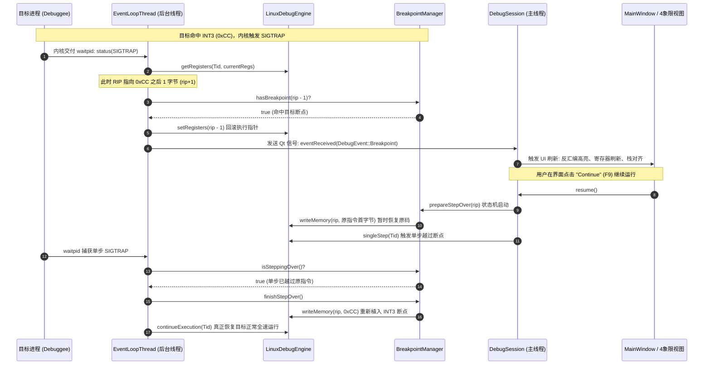
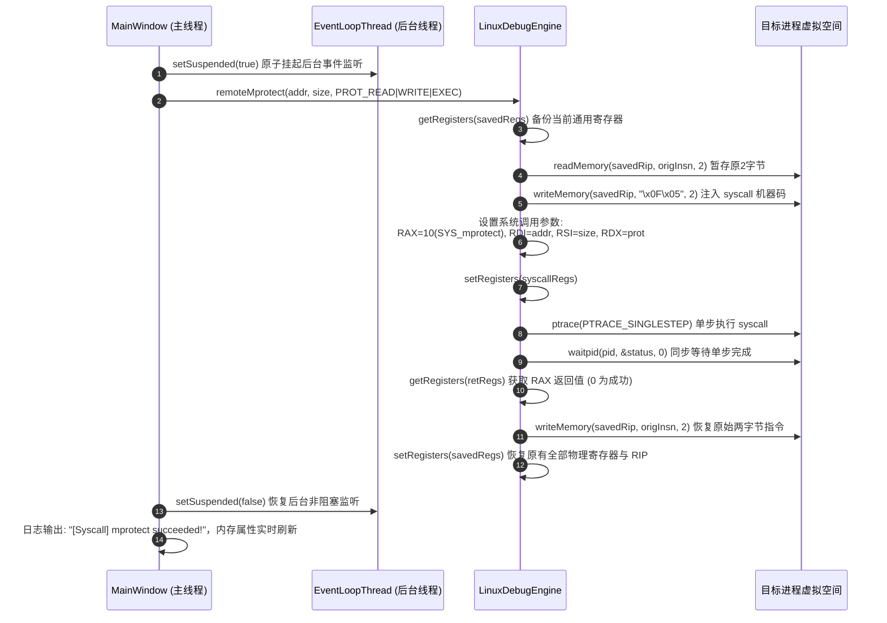

# edb-next 软件架构与工程设计说明书 (Software Design Document)

> **项目名称**：edb-next (Next-Generation Linux Binary Debugger & Reverse Engineering Platform)  
> **文档版本**：v1.0.0 (Release Candidate)  
> **开发语言**：C++20 / Qt 5.15+ / Capstone Engine  
> **面向平台**：Linux x86_64  
> **发布目标**：作为独立、现代化、工业级的开源逆向调试项目发布至 GitHub

---

## 目录

1. [项目愿景与定位 (Project Vision & Positioning)](#1-项目愿景与定位-project-vision--positioning)
   - 1.1 研发背景与行业痛点
   - 1.2 对标竞品与核心破局 (edb-next vs 原版 edb vs x64dbg)
   - 1.3 核心设计原则
2. [软件核心特点与架构亮点 (Key Characteristics & Architectural Highlights)](#2-软件核心特点与架构亮点-key-characteristics--architectural-highlights)
3. [已实现功能全景清单 (Complete Implemented Features Breakdown)](#3-已实现功能全景清单-complete-implemented-features-breakdown)
   - 3.1 核心内核与执行控制引擎
   - 3.2 反汇编与控制流分析引擎
   - 3.3 CPU 寄存器与机器状态管理
   - 3.4 内存管理、多路转储与物理落盘
   - 3.5 运行时堆栈与函数调用链回溯
   - 3.6 堆内存深度解构与 Linux 系统内省
   - 3.7 漏洞挖掘与高级逆向分析工具箱
   - 3.8 逆向工程数据库与会话持久化
   - 3.9 交互式命令行控制台与插件体系
   - 3.10 4 象限工作台与现代化 UI/UX 系统
4. [未实现功能与待完善规划 (Unimplemented Features & Technical Roadmap)](#4-未实现功能与待完善规划-unimplemented-features--technical-roadmap)
   - 4.1 多 CPU 架构与交叉调试扩展
   - 4.2 DWARF 源码级调试与行号映射
   - 4.3 嵌入式 Python 脚本自动化引擎
   - 4.4 高级反反调试与隐蔽断点机制
   - 4.5 C++ 符号反混淆与类型重建
   - 4.6 多进程 Follow-Fork 与 IPC 跟踪
   - 4.7 细粒度硬件读写监视点与页异常断点 UI
   - 4.8 GDB 远程调试协议 (RSP) 客户端支持
5. [代码结构与模块拓扑关系 (Codebase Structure & Module Architecture)](#5-代码结构与模块拓扑关系-codebase-structure--module-architecture)
   - 5.1 完整源码目录树与职责清单
   - 5.2 软件分层架构图
   - 5.3 核心类继承与接口关系图
   - 5.4 关键业务链路时序图
6. [详细系统设计思路与关键技术方案 (Detailed System Design & Technical Schemes)](#6-详细系统设计思路与关键技术方案-detailed-system-design--technical-schemes)
   - 6.1 异步非阻塞多线程事件模型设计
   - 6.2 断点全生命周期状态机设计
   - 6.3 远程系统调用注入方案 (`executeRemoteSyscall`)
   - 6.4 工业级表达式求值引擎 (`ExpressionEvaluator`)
   - 6.5 ELF 全景解析与虚存-文件映射算法 (`patchFileToDisk`)
   - 6.6 C++20 纯虚契约插件体系设计
   - 6.7 项目工程数据库持久化设计 (`.edb_db`)
7. [编译构建、安装与使用全流程指南 (Build, Installation & User Guide)](#7-编译构建安装与使用全流程指南-build-installation--user-guide)
   - 7.1 系统依赖与开发环境准备
   - 7.2 编译构建指令
   - 7.3 全量自动化测试套件运行
   - 7.4 逆向实战快速上手操作指南
8. [GitHub 独立开源发布与工程规范 (GitHub Release & Engineering Guide)](#8-github-独立开源发布与工程规范-github-release--engineering-guide)

---

## 1. 项目愿景与定位 (Project Vision & Positioning)

### 1.1 研发背景与行业痛点
在二进制逆向工程与动态调试领域，Windows 平台拥有极其成熟且生态繁茂的图形化调试利器——**x64dbg**，其直观的四象限工作流、强大的 CLI 命令行、多标签内存转储与工程持久化数据库深入人心。

反观 Linux 平台，长期处于两极分化的尴尬境地：
1. **GDB / GEF / pwndbg**：命令行交互极度强大，但在大中型复杂逆向分析、基本块控制流拓扑梳理、多路内存连续观察与直观热补丁对比时，纯终端字符界面存在不可避免的视觉疲劳与交互门槛；
2. **原版 edb-debugger**：作为 Linux 平台罕有的经典 Qt 图形化调试器，具有开创性意义。然而随着软件工程的发展，原版存在一系列阻碍生产力的问题：
   - **架构过度碎片化**：核心业务被硬拆分为 22 个小插件，插件间高度耦合，严重依赖全局静态服务查找；
   - **事件循环死锁顽疾**：主线程采用单线程 0ms `QTimer` 轮询 `waitpid`，在高频断点触发或多线程切换时极易引发事件饥饿、界面冻结甚至崩溃；
   - **核心逆向功能缺失**：仅支持单路内存转储（无法并排对比多个数据段）、无法动态绕过只读内存权限（修改内存直接报错）、缺乏一键补丁写回磁盘 ELF 文件的能力、缺乏工程分析成果持久化机制（退出即丢失所有注释与断点），且没有实用的 CLI 交互控制台。

### 1.2 对标竞品与核心破局 (edb-next vs 原版 edb vs x64dbg)
**edb-next** 旨在成为 **Linux 平台下首屈一指的工业级原生二进制图形化调试器**。它基于现代 C++20 与 Qt 5.15+ 进行完全从零的现代架构重构，彻底解决原版稳定性质缺陷，全方位深度对标并吸纳 x64dbg 经受住实战检验的经典操作手感，同时结合 Linux 内核特质打造原生独家杀手级功能。

| 维度 / 功能项 | 原版 edb (Linux) | x64dbg (Windows) | edb-next (现代 Linux 重构) | 核心突破与优势 |
| :--- | :---: | :---: | :---: | :--- |
| **语言与规范** | C++11 混合 C 宏 | C++14/17 | **现代 C++20 标准** | 强类型、RAII、Concepts、智能指针全面治理，零裸指针泄漏 |
| **事件循环并发** | 0ms QTimer 轮询 (易死锁假死) | 复杂同步事件 | **非阻塞 EventLoopThread** | 独立后台线程 `WNOHANG` 监听，Qt 信号槽异步调度，UI 毫秒级流畅响应 |
| **工作台布局** | 单一底部抽屉 (反复切Tab) | 经典四象限布局 | **4-Quadrant 黄金工作流** | 反汇编、寄存器、多路Dump、专有64位栈视图始终同屏四维联动 |
| **内存转储能力** | 单一 Hex Dump | 标配 Dump 1~5 | **4路独立 MultiDumpWidget** | 独立起始地址、滚动游标、历史栈与全域上下文跟随 |
| **只读内存修改** | 报错拒绝写入 | VirtualProtect 模拟 | **原生远程系统调用注入** | 注入 `SYS_mprotect` 原生突破只读页保护；支持 `SYS_mmap` 动态分配注入块 |
| **脱壳补丁落盘** | **无此功能** (仅内存补丁) | 导出 Patched PE | **创新 `patchFileToDisk`** | 解算 `VAddr -> FileOffset`，一键生成脱壳/修补后的物理独立可执行 ELF |
| **项目成果持久化** | 退出全盘丢失 | 标配 `.dd64` 数据库 | **`.edb_db` JSON 项目持久化** | 自动匹配二进制哈希/路径，全量恢复注释、书签、断点参数、监视表与笔记 |
| **命令行交互** | 无交互 CLI | 标配底栏命令行 | **x64dbg 风格 CommandBar** | 内置高频逆向指令、历史回溯、语法解析与插件命令无缝扩展 |
| **Linux 原生堆分析** | 插件支持较旧 | 不支持 Linux 堆 | **原生 Glibc ptmalloc 引擎** | 解析 `malloc_chunk` 链表、标志位 `A\|M\|P`，双击直达堆块内存 |
| **系统调用与信号** | 基础信号传递 | 不适用 | **POSIX 信号矩阵 + 透传** | 1~64 信号拦截/放行矩阵，`Shift+F7/F8/F9` 透传执行 |
| **漏洞利用辅助** | 基础 ROP 插件 | 需第三方插件 | **内置 ROP 工具箱** | 滑动窗口逆向提取 Gadgets，智能分类并一键导出 Python `p64(...)` 脚本 |

### 1.3 核心设计原则
1. **零死锁与永不冻结 (Zero Deadlock & UI Responsiveness)**：底层操作系统调用与等待全部置于后台独立线程，主界面只响应事件通知。
2. **高内聚低耦合 (High Cohesion & Low Coupling)**：核心引擎（`LinuxDebugEngine`）、断点管理（`BreakpointManager`）、解析器（`ElfParser`）与 GUI 彻底分离，核心层可剥离为独立 headless 调试库运行自动化测试。
3. **肌肉记忆完全平迁 (Muscle Memory Compatibility)**：按键映射（F2/F4/F7/F8/F9/Ctrl+*等）、跳转逻辑与查看习惯完全贴合逆向人员最高效的操作直觉。
4. **可逆性与工程可追溯 (Reversibility & Persistence)**：任何内存补丁皆可随时撤销/重做；任何逆向分析沉淀皆可落盘与版本化存储。

---

## 2. 软件核心特点与架构亮点 (Key Characteristics & Architectural Highlights)

### 2.1 前后台完全解耦的异步事件循环模型
原版 edb 最臭名昭著的问题是主 UI 线程利用 0ms 定时器循环调用 `waitpid()`，导致 UI 处理与内核状态查询争夺时间片。edb-next 彻底摒弃该设计：
- **`EventLoopThread` 独立守护**：在单独的 `QThread` 中以非阻塞 `waitpid(-1, &status, __WALL | WNOHANG)` 模式循环轮询；
- **原子状态挂起机制 (`suspended_`)**：当主线程需要发起前台同步系统操作（如注入 `SYS_mprotect` 执行单步探测）时，原子挂起后台循环，杜绝事件捕获竞态，确保前后台零死锁。

### 2.2 目标地址空间远程系统调用原子注入 (`executeRemoteSyscall`)
传统 Linux 调试器在遇到只读内存（如 `.rodata` 或无写权限的 `.text` 段）时，无法写入补丁，且无法在被调试目标进程中申请新的堆内存。edb-next 实现了创新的 **Remote Syscall Injection**：
- 暂存当前线程全部寄存器上下文与指令指针；
- 在当前 RIP 处临时覆写 `0x0F 0x05` (`syscall`) 指令；
- 将系统调用号及最多 6 个参数装入 `RAX`, `RDI`, `RSI`, `RDX`, `R10`, `R8`, `R9`；
- 发起 `PTRACE_SINGLESTEP` 驱动内核执行系统调用；
- 捕获单步完成信号，从 `RAX` 提取内核返回值；
- 恢复被覆写的原始指令，并原子还原寄存器上下文。  
由此，调试器获得了在目标地址空间任意执行 `SYS_mprotect`（修改虚拟页保护）、`SYS_mmap`（动态分配独立可执行内存块）、`SYS_munmap`（内存释放）的强大特权。

### 2.3 物理磁盘 ELF 补丁落盘引擎 (`patchFileToDisk`)
大部分逆向人员在调试器中完成破解（如将 `jz` 改为 `nop` 或 `jmp`）后，不得不打开外部十六进制编辑器二次寻找文件偏移修补。edb-next 原生内置 **ELF 物理磁盘落盘算法**：
- `ElfParser` 解析目标 ELF 的 `Program Headers` (`PT_LOAD`) 与 `Section Headers`；
- 根据已记录的内存补丁虚拟地址 $V$，匹配对应包含该地址的加载段，利用公式解算物理文件偏移：
  $$\text{FileOffset} = V - \text{Segment.p\_vaddr} + \text{Segment.p\_offset}$$
- 支持一键将整套补丁写回磁盘生成独立的修改版 ELF 二进制，并赋予可执行权限，真正实现从动态逆向到静态落地的一站式闭环。

### 2.4 逆向工程数据库自动持久化 (`.edb_db`)
逆向工作是一项耗时极大的知识密集型任务。edb-next 设计了标准化 JSON 逆向数据库架构：
- 记录二进制文件的绝对路径、哈希指纹、用户逆向随笔草稿（Notes）；
- 完整沉淀全量行注释（Comments）、书签索引（Bookmarks）、断点配置（含触发条件、命中间隔、仅日志格式串）、监视表达式列表（Watches）与内存补丁项（Patches）；
- **全自动无感加载**：当用户在主窗口再次打开相同的二进制程序时，系统自动在对应目录下探寻同名 `.edb_db` 文件并瞬间恢复全量逆向成果。

### 2.5 经典四象限 (4-Quadrant) 黄金调试工作台
彻底解决传统单抽屉界面频繁在内存、栈和反汇编之间来回切换的割裂感：
- **左上象限**：`DisassemblyView`，集成实时 Capstone 语法高亮、指令前缀折叠、操作数有效地址预览、分支跳转色彩线条；
- **右上象限**：`RegisterView`，16 大 64 位通用寄存器（整齐对齐，变动标红）、EFLAGS 翡翠绿交互翻转徽章条、SSE/AVX 向量组；
- **左下象限**：`MultiDumpWidget`（Dump 1 ~ Dump 4 独立内存标签页），搭配 18 大按需展开的高级分析抽屉；
- **右下象限**：**专有独立 64 位调用栈 (`StackView`)**，QWORD 展开、相对 RSP/RBP 偏移动态计算、栈指针有效性探测与字符串/函数符号深度自动解引用。

---

## 3. 已实现功能全景清单 (Complete Implemented Features Breakdown)

本章节详尽列出当前 `edb-next` 已经实装、并通过全量单元测试与回归验证的所有核心功能。

### 3.1 核心内核与执行控制引擎
1. **进程生命周期管控**：
   - **Launch**：通过 `fork()` + `PTRACE_TRACEME` 派生子进程，调用 `personality(ADDR_NO_RANDOMIZE)` 支持原生一键禁用 ASLR；
   - **Attach**：支持通过 PID 挂钩已存在的 Linux 进程，安全拦截并接管目标；
   - **Detach / Terminate / Restart**：优雅脱钩释放、强行销毁目标或使用原有参数即刻重启调试会话（`Ctrl+F2`）。
2. **多模式执行控制**：
   - **Continue (F9)**：继续执行目标程序；
   - **Single Step Into (F7)**：单步步入当前指令；
   - **Single Step Over (F8)**：单步步过（识别 `CALL` 指令自动在下一行下临时断点）；
   - **Step Out (Shift+F11)**：安全提取 Frame #1 返回地址，自动下断并运行至跳出当前函数；
   - **Run to Selection (F4)**：在光标所在行打下一次性临时断点并继续运行，命中即销；
   - **Pause**：前台一键异步挂起目标执行。
3. **断点控制与状态机**：
   - **软件断点 (INT3)**：向目标代码注入 `0xCC` 机器码，命中时内核回退 RIP，恢复原始操作码，激活 `PTRACE_SINGLESTEP` 越过断点，随后重新植入 `0xCC` 恢复断点状态；
   - **DR0~DR7 硬件断点**：自动分配 4 个硬件调试寄存器，支持执行断点（Execute）、写监视点（Write 1/2/4/8 字节）与读写监视点（Read/Write 1/2/4/8 字节）；
   - **条件断点 (Conditional Breakpoint)**：挂接递归下降表达式求值引擎，支持寄存器（`rdi == 7`）、内存指针解引用（`[rbp-8] > 0`）与逻辑关系运算；
   - **命中间隔 (Ignore Count)**：支持配置忽略前 $N$ 次命中，专门用于调试大型循环体；
   - **仅日志断点 (Log Only / Trace Points)**：命中时不阻断目标运行，仅将格式化寄存器/表达式求值结果打印至系统调试日志。
4. **POSIX 信号管理与透传矩阵**：
   - 偏好设置中提供 1~64 号标准与实时 POSIX 信号（SIGSEGV, SIGTRAP, SIGINT 等）的拦截与忽略策略矩阵；
   - 菜单栏提供 `Shift+F7` (Step Into Pass Signal)、`Shift+F8` (Step Over Pass Signal)、`Shift+F9` (Run Pass Signal) 三大透传动作。
5. **远程系统调用注入与目标内存管理**：
   - `remoteMprotect` (`SYS_mprotect`)：就地动态更改任意虚拟内存页的权限（RWX / RX / RW / RO / None）；
   - `remoteMmap` (`SYS_mmap`)：在目标进程地址空间中动态匿名分配任意大小的独立内存页；
   - `remoteMunmap` (`SYS_munmap`)：动态释放目标进程中的匿名内存块；
   - `setInstructionPointer` (Set RIP / `Ctrl+*`)：强制改变指令指针并写回物理寄存器。
6. **多线程枚举与无锁切换**：
   - 实时遍历 `/proc/<pid>/task/` 任务树，查询每条线程的运行状态（Running, Sleeping, Traced）与独立寄存器上下文；
   - 工作台 Tab 10 支持双击或按钮即时切换活动 TID，底层安全代理 `PTRACE_EVENT_CLONE` 与新线程事件。

### 3.2 反汇编与控制流分析引擎
1. **Capstone x86_64 高性能反汇编**：
   - 64 位指令集语法着色、指令操作码十六进制展示、Intel 规范汇编语法输出；
   - 自动解析 `[rip + disp]` 相对寻址，计算绝对物理目标地址并匹配全局符号。
2. **EFLAGS 动态分支预测推演**：
   - `InstructionInspector` 解析基址变址复合内存寻址（`base + index*scale + disp`）；
   - 根据当前实时标志位（ZF, SF, OF, CF）动态推算条件跳转是否发生（`[JUMP TAKEN]` / `[JUMP NOT TAKEN]`），常驻在主工作台底部状态条。
3. **交互式基本块控制流图 (CFGGraphView - Tab 14)**：
   - 自动切分函数基本块（Basic Blocks），分析无条件跳转、条件跳转（True 分支）与 Fall-through（False 直行分支）；
   - 采用有向图层级分层拓扑渲染，绿色标识条件满足跳转，红色标识条件不满足直行，蓝色标识无条件跳转；
   - 支持鼠标拖拽平移、滚轮无级缩放、双击节点直接联动反汇编定位。
4. **分支跟随与导航历史堆栈 (Follow Branch & Navigation History)**：
   - 快捷键 **Enter**：自动解析当前指令分支目标（`CALL`, `JMP`, `Jcc`），将当前地址压入导航历史栈并瞬时跳转至目标；
   - 快捷键 **Esc / Backspace / Alt+Left**：瞬时回退至上一个逆向分析点，**Alt+Right** 前进，逆向函数调用极为流畅。
5. **代码交叉引用检索器 (CodeXRefFinder & XRefDialog)**：
   - 快捷键 **X**：极速扫描目标代码段中所有指向当前光标地址的 `CALL`、`JMP`、`Jcc` 与 `LEA [rip + disp]` 引用，双击列表直达调用点。
6. **原生 GNU 内联汇编器 (Assembler)**：
   - 快捷键 **Space**：基于原生 GNU `as` + `objcopy` 进行即时汇编；
   - 智能计算替换字节差值，支持一键自动使用 `0x90 (NOP)` 补齐指令长度，保护后续汇编指令对齐。
7. **高级操作码与指令序列搜寻引擎 (OpcodeSearcher - Tab 19)**：
   - 高速扫描目标全部可执行内存段；
   - 预置高频漏洞挖掘模式：`JMP <reg>`、`CALL <reg>`、`PUSH <reg>; RET`、`POP <reg>; RET`、`Syscall / Interrupt`，并支持用户自定义指令子串与正则过滤。

### 3.3 CPU 寄存器与机器状态管理
1. **通用寄存器表 (GPRs)**：
   - 呈现 16 大通用寄存器十六进制值与十进制数值，数值变动翡翠红高亮；
   - **智能解引用与符号推导**：自动匹配就近 ELF 符号偏移（`<main+0x10>`）、栈指针标注（`=> [RSP]`）、探测 ASCII 字符串预览（`"Hello"`）与二级指针链（`-> 0x5555... <target>`）。
2. **EFLAGS 交互翻转条**：
   - 顶部提供 `CF`, `PF`, `AF`, `ZF`, `SF`, `TF`, `IF`, `DF`, `OF` 徽章按钮；
   - 翡翠绿（置位）与暗灰（清零）实时色彩反馈，鼠标左键单击即时物理反转标志位并写回寄存器。
3. **SSE / AVX XMM 向量寄存器组**：
   - 内核驱动层接入 `PTRACE_GETFPREGS` 与 `NT_FPREGSET`；
   - 专属 FPU/SSE 面板同时呈现 128 位十六进制、4 组 Float32、2 组 Double64 浮点值，支持双击就地修改。
4. **全域右键上下文菜单联动**：
   - 寄存器表右键支持 "Follow in Disassembly"、"Follow in Dump"、"Modify Value"、"Zero Register"（一键清零）、"Toggle Value"（按位取反）与快捷复制。
5. **CPU 机器状态全景快照生成器 (StateDumper - `Ctrl+D`)**：
   - 对标原版 edb 的 `DumpState` 插件，一键生成包含 PID、16 GPRs 对齐排布、9 EFLAGS 逐位展开、RIP 上下文指令窗口与运行时栈顶 8 组 QWORD 的精细快照报告，自动复制至系统剪贴板。

### 3.4 内存管理、多路转储与物理落盘
1. **4路独立 MultiDumpWidget (Dump 1 ~ Dump 4)**：
   - 完全对齐 x64dbg 标配体验，提供 4 个独立内存转储标签页，各页具备独立的基地址、滚动位置与历史记录；
   - 外部联动信号（反汇编、寄存器或栈视图的 "Follow in Dump"）智能路由至当前活动 Dump 页。
2. **内存十六进制就地热补丁**：
   - 快捷键 **Ctrl+E**：支持输入任意十六进制机器码并直接写入内存页；提供一键 NOP 填充与零填充。
3. **集中补丁管理器 (PatchManager & PatchManagerDialog - `Ctrl+P`)**：
   - 集中列出当前会话的所有修改点、原字节与修改后字节对照，支持单个或批量撤销/重做。
4. **物理磁盘 ELF 文件落盘 (`patchFileToDisk`)**：
   - 基于 ELF 加载段自动将虚拟地址映射为物理文件偏移，一键输出脱壳或打好补丁的可执行文件。
5. **内存段原始二进制导出 (`.bin`)**：
   - 内存区域表右键一键将目标进程任意内存段完整导出为磁盘原始二进制文件。
6. **带 `??` 通配符的特征码内存搜索 (PatternSearcher)**：
   - 支持形如 `f3 0f ?? fa` 的通配符掩码搜寻，极速定位可变特征代码。
7. **内存字符串深度扫描 (StringScanner)**：
   - 自动遍历进程可读内存段提取 ASCII 字符串（$\ge 4$ 字符），并自动反向索引代码段中的引用位置。

### 3.5 运行时堆栈与函数调用链回溯
1. **专有 64 位机器字栈视图 (Dedicated StackView)**：
   - 独立常驻于右下象限，以 8 字节 QWORD 呈现：
     - **Address 列**：青色展示物理虚拟栈地址；
     - **Value 列**：高亮呈现 64 位数值，双击智能路由（代码指针跳反汇编，数据指针跳 Dump）；
     - **Offset 列**：动态计算相对当前 RSP/RBP 偏移（`=> RSP`、`+0x08`、`[RBP]`、`[RBP-0x10]`）；
     - **Symbol / Comment 列**：自动绑定函数符号、偏移及内存字符串预览。
   - 顶部快捷操作条：`[RSP]` (回栈顶)、`[RBP]` (跳基址)、`[Go to...]`、快捷键 `Shift+S` (展开/折叠)。
2. **RBP 栈帧安全回溯引擎 (CallStackUnwinder & CallStackView - Tab 3)**：
   - 校验 8 字节对齐、严格地址递增与内存可读性，防止格式错误引发调试器奔溃；
   - 深度回溯 Frame #0 ~ Frame #N，符号化展示调用者地址，双击直接联动反汇编。

### 3.6 堆内存深度解构与 Linux 系统内省
1. **Glibc ptmalloc 堆内存深度剖析器 (HeapAnalyzer & HeapView - Tab 9)**：
   - 自动检索虚拟内存段中的 `[heap]` 区域；
   - 沿着 `malloc_chunk` 结构体链条解析 `prev_size`、`size` 及标志位（`A|M|P`），精准识别 Allocated 块、Free 块与 Top Chunk；
   - 双击堆块即刻在内存转储区定位至用户数据区。
2. **ELF 文件结构全景视图 (BinaryInfoView - Tab 17)**：
   - 深度解析 64 位 ELF 核心文件头；
   - 解析 `Program Headers (Segments)`（虚拟/物理地址、段权限、对齐）与完整 `Section Headers`（`.text`, `.rodata`, `.data`, `.bss`, `.plt`, `.got`）；
   - 解析 `DT_NEEDED` 动态依赖共享库列表（如 `libc.so.6`, `libpthread.so.0`）；
   - 双击节区或段直接联动反汇编（代码段）或十六进制 Dump（数据段）。
3. **跨模块共享库 API 外呼分析器 (IntermodularCallsView - Tab 18)**：
   - 深度扫描主程序代码段对外部共享库 API（PLT/GOT）的调用（`puts`, `printf`, `malloc`, `free` 等）；
   - 支持按 API 名称模糊过滤，双击直达调用现场。
4. **进程环境与文件描述符句柄追踪 (ProcessPropertiesView - Tab 8)**：
   - 深度读取 `/proc/<pid>/cmdline`、`/proc/<pid>/environ`、`/proc/<pid>/status`；
   - 遍历 `/proc/<pid>/fd/` 并解引用软链接，智能识别普通文件、网络套接字 (Socket)、管道 (Pipe) 与终端 (PTY)。

### 3.7 漏洞挖掘与高级逆向分析工具箱
1. **ROP Gadget 扫描与漏洞利用生成器 (ROPScanner & ROPToolView - Tab 11)**：
   - 反向滑动窗口扫描可执行段，提取以 `ret`, `syscall`, `int 0x80` 结尾的指令序列；
   - 智能分类归档：`StackPivot`, `Syscall`, `MemoryWrite`, `Arithmetic`, `General`；
   - 支持一键生成 Python 漏洞利用 Payload（`p64(...)` 格式）并复制至剪贴板。
2. **代码执行追踪与时间旅行回溯 (TraceEngine & TraceView - Tab 13)**：
   - **Hit Trace (代码覆盖率)**：执行过程中实时高亮已覆盖指令地址，统计覆盖总数；
   - **Run Trace (指令执行历史记录)**：单步追踪记录执行流，自动对比前后两帧寄存器差异并标红变动；
   - **时间旅行单帧导航**：支持 `< Step Back` 与 `Step Forward >`，在历史记录中自由回溯，实时联动寄存器与反汇编光标；
   - **Auto Trace (自动步进)**：支持设定最大步数限制与条件表达式中断。
3. **动态监视表达式窗口 (WatchView - Tab 12)**：
   - 支持常驻监视用户自定义的表达式（如 `rax`、`[rbp-8]`、`rax + rbx`）；
   - 单步调试过程中自动重算求值，数值发生变动时高亮提示。
4. **逆向草稿随手记 (NotesView - Tab 15)**：
   - 集成 Monospace 文本编辑器；
   - 提供一键插入当前 RIP 地址、插入时间戳、导出为 `.md` 文档及同步至项目数据库功能。

### 3.8 逆向工程数据库与会话持久化
1. **DatabaseManager 核心机制**：
   - 采用标准 JSON 结构持久化所有注释、书签、断点（含高级属性）、内存补丁、监视表达式与随笔笔记；
   - 支持快捷键 `Ctrl+S` 手动保存与 `Ctrl+Shift+S` 另存为；
   - 重新打开相同目标程序时自动匹配同名 `.edb_db` 数据库文件，无感恢复全量分析环境。

### 3.9 交互式命令行控制台与插件体系
1. **底部常驻极客命令行控制台 (CommandBarView)**：
   - 常驻主界面底部，支持上下箭头历史记录回溯与自动命令分发；
   - 内置指令集：
     - `bp [addr|sym]`：下软件断点
     - `bph [addr]`：下硬件执行断点
     - `bc [addr]` / `bd [addr]` / `be [addr]`：清除 / 禁用 / 启用断点
     - `r [reg] [val]`：修改通用寄存器数值
     - `d [addr]`：在当前 Dump 标签页跳转至指定地址
     - `u [addr]`：在反汇编视图跳转至指定地址
     - `step` / `stepo` / `ret` / `run`：单步步入 / 单步步过 / 跳出 / 运行
     - `eval [expr]`：求值表达式并打印结果
     - `mprotect [addr] [size] [prot]`：动态修改目标内存权限
     - `alloc [size] [prot]`：动态分配目标内存
     - `dumpstate`：导出 CPU 状态快照
     - `help`：列出当前全部内置及插件扩展指令。
2. **现代化 C++20 解耦插件体系**：
   - 纯虚接口契约 `IPlugin` 与能力网关 `IPluginContext`；
   - `PluginManager` 基于 `QPluginLoader` 动态扫描并装载 `.so` 动态库；
   - 插件可向宿主注入主菜单栏项、注册 CLI 命令行扩展、挂接断点拦截钩子与生命周期事件；
   - 提供工业级参考插件工程 `SamplePlugin`（输出 `sample_plugin.so`）。

### 3.10 4 象限工作台与现代化 UI/UX 系统
1. **现代暗黑极客主题 (Dark Geek QSS)**：
   - 专为长周期逆向分析定制的高对比度暗黑样式：微圆角标签页、科技蓝 2px 激活指示条、高对比表头与极简滚动条。
2. **高对比度断点与执行指针指示器**：
   - 当前执行行 (RIP)：深青高亮背景与翠绿粗体指示箭头 `➔`；
   - 软件/硬件断点行：深红背景与红色圆点标识；
   - 断点兼当前 RIP 行：复合洋红强调色。
3. **全局快捷键习惯对齐**：
   - 支持快速窗口切换：`Alt+C` (CPU/反汇编)、`Alt+D` (Dump)、`Alt+K` (调用栈)、`Alt+B` (断点)、`Alt+M` (内存段)、`Alt+E` (符号)、`Alt+L` (日志)。
4. **Wayland 与多分辨率窗口自适应优化**：
   - 彻底解决 GNOME Mutter / Wayland 环境下最大化限制问题，最小约束宽度精简至 358px，在高分屏及笔记本屏幕上自由伸缩、秒级最大化。

---

## 4. 未实现功能与待完善规划 (Unimplemented Features & Technical Roadmap)

作为一款立志独立发布至 GitHub 并长期维护的开源项目，必须对现有版本的技术边界有清晰、坦诚的认知。本章梳理出当前版本尚未实现或待进阶完善的功能，作为后续版本的官方演进路线图 (Roadmap)。

### 4.1 多 CPU 架构与交叉调试扩展 (Multi-Architecture Support)
- **当前状态**：当前引擎深度绑定 Linux x86_64 架构（依赖 `user_regs_struct`、`user_fpregs_struct` 以及 x86_64 DR0~DR7 调试寄存器）。
- **待完善方案**：
  1. **x86 32-bit (IA-32) 兼容**：引入 32 位 ELF 识别，在 64 位宿主上通过 `compat_ptrace` 支持调试 32 位 Linux 二进制程序（EAX..ESP、EFLAGS）；
  2. **ARM64 / AArch64 原生支持**：抽象 `IRegisterContext` 与 `IDebugEngine` 工厂，针对 ARM64 平台实现基于 `NT_PRSTATUS` / `PTRACE_GETREGSET` 的 X0~X30 寄存器组及硬件断点（`PTRACE_SETHBPREGS`）支持；
  3. **RISC-V (RV64GC) 探索**：为国内新兴开源硬件生态预留接口契约。

### 4.2 DWARF 源码级调试与行号映射 (Source-Level Debugging)
- **当前状态**：当前 `ElfParser` 仅解析了 `.symtab` 与 `.dynsym` 符号表，实现了函数名与全局变量地址匹配，但不包含源码级调试信息。
- **待完善方案**：
  1. **libdw / libdwarf 接入**：集成 DWARF 调试信息解析库，提取 `.debug_info`、`.debug_line` 节区；
  2. **源码反汇编混合渲染**：当检测到目标程序编译带 `-g` 时，在反汇编视图对应代码行上方内嵌展示 C/C++ 原始源码行；
  3. **源码文件浏览器**：提供类似 GDB `layout src` 的独立源码浏览标签页，支持直接在源码行双击下断。

### 4.3 嵌入式 Python 脚本自动化引擎 (Embedded Python Scripting)
- **当前状态**：当前支持 C++20 原生 `.so` 动态插件，并通过 CLI 控制台支持外部扩展命令，但尚未嵌入动态脚本语言解释器。
- **待完善方案**：
  1. **Python 3 C-API / pybind11 桥接**：构建名为 `python_bridge` 的核心模块或专属插件；
  2. **开放 Python API 命名空间**：提供 `import edb_next`，向脚本暴露 `session.read_memory()`、`session.write_memory()`、`session.get_regs()`、`session.add_breakpoint()`、`session.step()` 等原生控制接口；
  3. **自动化脱壳与漏洞利用脚本运行器**：支持在界面一键加载并运行用户编写的 `.py` 脚本，实现无人工值守的复杂解密、自动化脱壳与内存提取。

### 4.4 高级反反调试与隐蔽断点机制 (Anti-Anti-Debugging & Stealth)
- **当前状态**：调试机制基于原生 `ptrace`，在遇到高强度对抗样本（如恶意加固壳、CTF 混淆题目）时，目标程序通过检测自身是否被 ptrace（如主动调用 `PTRACE_TRACEME`、检查 `/proc/self/status` 中的 `TracerPid` 或测量 `rdtsc` 时间差）能够察觉调试器存在。
- **待完善方案**：
  1. **`TracerPid` 伪装**：基于注入技术 Hook 或通过内核模块虚拟化目标读取 `/proc/self/status` 的行为；
  2. **RDTSC 指令陷阱抹平**：利用 CR4 寄存器标志或硬件单步对 `rdtsc` / `rdtscp` 指令进行时间戳平滑，抹平单步执行的时间延迟；
  3. **隐匿执行断点 (Page-Guard Breakpoint)**：基于内存页权限陷阱实现无 `0xCC` 注入的纯内存断点，绕过目标进程对代码段内存校验和（CRC/Hash）的自校验防篡改机制。

### 4.5 C++ 符号反混淆 (Demangling) 与复合数据类型重建
- **当前状态**：当前展示的函数符号为 GCC/Clang 导出的原始 Mangled 字符串（例如 `_Z13calculate_fibi`）。
- **待完善方案**：
  1. **Itanium ABI Demangler 原生集成**：集成 `abi::__cxa_demangle`，将修饰后的符号实时渲染为可读签名（如 `calculate_fib(int)`）；
  2. **结构体与类型布局可视化 (Type Viewer)**：允许逆向人员导入 C 语言头文件或手动定义结构体（struct/union），将内存转储视图按结构体字段格式化对齐解析。

### 4.6 多进程 Follow-Fork 与 IPC 跟踪
- **当前状态**：当前版本专注于单进程多线程模型，目标调用 `fork()` 或 `vfork()` 时，默认仅跟踪父进程。
- **待完善方案**：
  1. **`PTRACE_O_TRACEFORK` / `TRACEVFORK` 拦截**：在 `LinuxDebugEngine` 中启用内核 fork 事件监听；
  2. **多进程树状会话管理**：当派生子进程时，`SessionManager` 自动生成新的 `DebugSession` 实例，主窗口通过多标签页（Tab）无缝管理父子进程。

### 4.7 细粒度硬件读写监视点与页异常断点 UI 增强
- **当前状态**：底层已完整实现 DR0~DR7 的 1/2/4/8 字节硬件执行与读写监视点，但主反汇编窗口右键菜单目前以执行断点为主。
- **待完善方案**：
  1. **内存转储区右键直下硬件监视点**：在 Hex Dump 视图中选中 1/2/4/8 字节，右键直接下硬件写断点或硬件读写断点；
  2. **硬件断点触发溯源**：解析调试状态寄存器 DR6（`B0`~`B3` 标志位），明确在界面状态栏提示“硬件监视点命中：地址 0x... 被写入”。

### 4.8 GDB 远程调试协议 (RSP) 客户端支持
- **当前状态**：当前直接运行于 Linux 本地，基于操作系统原生系统调用。
- **待完善方案**：
  1. **GDB RSP 协议后端**：实现一套 `RspDebugEngine`，通过 TCP 套接字与远端 `gdbserver`、QEMU 模拟器或嵌入式板卡通信；
  2. **跨平台远程逆向**：使 edb-next 成为通用的 GUI 前端，既可调试本地 Linux 二进制，亦可远程附加 Android、路由器固件或车载系统。

---

## 5. 代码结构与模块拓扑关系 (Codebase Structure & Module Architecture)

### 5.1 完整源码目录树与职责清单

```text
edb-next/
├── CMakeLists.txt              # 顶层 CMake 构建脚本 (C++20, Qt5, Capstone)
├── main.cpp                    # 入口文件 (QApplication 初始化、暗黑 QSS 注入、MainWindow 启动)
├── core/                       # 核心业务逻辑与调试引擎 (纯 C++，低 GUI 依赖)
│   ├── Types.hpp               # Address, Pid, Tid, DebugEvent, MemoryRegion 等基石类型
│   ├── UniqueFd.hpp            # RAII 文件描述符封装
│   ├── RegisterContext.hpp     # 64 位通用寄存器上下文封装与 EFLAGS 标志位位掩码操作
│   ├── LinuxDebugEngine.hpp/cpp# ptrace 系统调用层、硬件寄存器、/proc/mem 读写、远程系统调用注入
│   ├── BreakpointManager.hpp/cpp# 软硬件断点注册、条件与命中间隔管理、先单步后恢复状态机
│   ├── EventLoopThread.hpp/cpp # 后台独立 QThread 事件循环 (waitpid + WNOHANG + 原子挂起)
│   ├── ElfParser.hpp/cpp       # 64位 ELF 文件头、Program Headers、Section Headers、符号表与依赖解析
│   ├── CallStackUnwinder.hpp/cpp# 基于 RBP 栈帧链的安全回溯算法
│   ├── StringScanner.hpp/cpp   # 可读段连续 ASCII 字符串提取与 RIP 相对寻址反向索引
│   ├── AnnotationManager.hpp/cpp# 用户注释 (Comments) 与书签 (Bookmarks) 内存管理
│   ├── FunctionFinder.hpp/cpp  # 基于 Prologue/Epilogue 特征码的函数边界识别引擎
│   ├── HeapAnalyzer.hpp/cpp    # Glibc ptmalloc 堆内存 malloc_chunk 结构解析器
│   ├── Assembler.hpp/cpp       # 基于系统 GNU as + objcopy 的原生内联汇编编译器
│   ├── ExpressionEvaluator.hpp/cpp# 递归下降表达式解析器 (支持寄存器、常数、指针解引用与关系运算)
│   ├── ROPScanner.hpp/cpp      # 反向滑动窗口 ROP Gadget 搜寻分类与 Python Payload 导出器
│   ├── InstructionInspector.hpp/cpp# 有效内存寻址计算与 EFLAGS 动态条件分支预测引擎
│   ├── CodeXRefFinder.hpp/cpp  # 代码交叉引用检索引擎 (快速定位指向目标的 CALL/JMP/LEA)
│   ├── PatternSearcher.hpp/cpp # 带 '??' 通配符掩码的十六进制特征码高速搜寻引擎
│   ├── ConfigurationManager.hpp/cpp# 全局偏好配置中心 (QSettings 序列化至 ~/.config/edb-next/config.ini)
│   ├── IPlugin.hpp             # 现代 C++20 插件纯虚接口契约
│   ├── IPluginContext.hpp      # 插件宿主能力网关接口 (提供菜单注入、命令注册与引擎访问)
│   ├── PluginManager.hpp/cpp   # 动态插件扫描、加载、卸载与生命周期管理
│   ├── PatchManager.hpp/cpp    # 内存补丁撤销/重做管理与物理 ELF 磁盘落盘引擎 (patchFileToDisk)
│   ├── TraceEngine.hpp/cpp     # Hit Trace 覆盖率与 Run Trace 帧差分及时间旅行回溯引擎
│   ├── LogManager.hpp/cpp      # 统一高吞吐线程安全调试日志与事件总线
│   ├── DatabaseManager.hpp/cpp # .edb_db 逆向工程数据库 JSON 序列化与反序列化引擎
│   ├── IntermodularCallsFinder.hpp/cpp # 跨模块/共享库动态链接 API (PLT/GOT) 外呼分析器
│   ├── OpcodeSearcher.hpp/cpp  # Capstone 指令操作码特征序列高级搜寻引擎
│   ├── StateDumper.hpp/cpp     # CPU 机器状态格式化快照转储引擎 (对标 edb DumpState)
│   ├── DebugSession.hpp/cpp    # 独立调试会话高阶门面 (外观模式，聚合引擎、断点、线程与解析器)
│   └── SessionManager.hpp/cpp  # 多会话容器与活动会话调度器
├── ui/                         # 现代 Qt5 GUI 表现层
│   ├── DisassemblyView.hpp/cpp # 核心反汇编视图 (语法着色、分支跟随、历史栈、右键联动)
│   ├── RegisterView.hpp/cpp    # 通用寄存器视图 (智能解引用、EFLAGS 徽章翻转条、SSE/AVX)
│   ├── MemoryHexView.hpp/cpp   # 十六进制内存视图 (支持就地编辑、零填充、NOP填充与导出)
│   ├── MultiDumpWidget.hpp/cpp # 多标签页独立内存转储容器 (Dump 1 ~ Dump 4)
│   ├── StackView.hpp/cpp       # 专有 64 位机器字栈视图 (QWORD 对齐、RSP/RBP 偏移计算、符号解引用)
│   ├── MemoryRegionsView.hpp/cpp# 内存分页段表 (集成 mprotect / mmap / munmap 交互管理)
│   ├── BreakpointManagerView.hpp/cpp# 高级断点管理面板 (列表浏览、条件修改、命中间隔、仅日志)
│   ├── CallStackView.hpp/cpp   # 函数调用栈回溯列表面板
│   ├── StringReferencesView.hpp/cpp# 内存字符串检索与交叉引用直达面板
│   ├── SymbolViewer.hpp/cpp    # 全局符号浏览器与过滤面板
│   ├── ProcessPropertiesView.hpp/cpp# 进程环境、命令行与文件描述符分类面板
│   ├── HeapView.hpp/cpp        # 堆内存分析与 Chunk 状态可视化面板
│   ├── ThreadsView.hpp/cpp     # 多线程状态表与活动线程双击切换面板
│   ├── ROPToolView.hpp/cpp     # ROP Gadget 分类浏览器与 Python Payload 导出面板
│   ├── WatchView.hpp/cpp       # 动态监视表达式常驻窗口
│   ├── TraceView.hpp/cpp       # 执行追踪、自动步进与时间旅行历史导航面板
│   ├── CFGGraphView.hpp/cpp    # 交互式基本块控制流有向图视图
│   ├── NotesView.hpp/cpp       # 随手记逆向分析草稿笔记视图
│   ├── LogView.hpp/cpp         # 实时系统日志与分级过滤控制台
│   ├── BinaryInfoView.hpp/cpp  # ELF 文件头、节区表、段头表与动态依赖全景视图
│   ├── IntermodularCallsView.hpp/cpp # 跨模块共享库 API 外呼搜寻与定位视图
│   ├── OpcodeSearcherView.hpp/cpp# 指令序列搜寻视图 (工作台 Tab 19)
│   ├── CommandBarView.hpp/cpp  # 底部 x64dbg 风格交互式 CLI 命令栏
│   ├── PreferencesDialog.hpp/cpp# 7 大分类完整偏好设置对话框
│   ├── LaunchArgumentsDialog.hpp/cpp# 目标命令行参数与工作目录配置弹窗
│   ├── PluginManagerDialog.hpp/cpp# 插件管理与热加载控制对话框
│   ├── PatchManagerDialog.hpp/cpp# 集中补丁管理与文件磁盘保存对话框 (Ctrl+P)
│   ├── XRefDialog.hpp/cpp      # 交互式代码交叉引用跳转弹窗
│   ├── SessionTabWidget.hpp/cpp# 4 象限黄金工作台容器 + 19 大分析抽屉 + 底部动态推演条
│   └── MainWindow.hpp/cpp      # 主窗口 (标准菜单栏、工具栏、全局快捷键分发、项目持久化)
├── plugins/
│   └── SamplePlugin/           # 标准 C++20 参考插件工程 (编译为 sample_plugin.so)
│       ├── SamplePlugin.hpp/cpp
│       └── CMakeLists.txt
└── tests/                      # 自动化测试套件
    ├── test_target.c           # 多线程测试目标二进制源码
    ├── test_core.cpp           # 核心基础能力全量回归测试套件 (Phase 1 ~ Phase 5)
    ├── test_advanced.cpp       # 进阶特性全量回归测试套件 (Phase 6 ~ Phase 8, 10 大专题)
    └── test_exit.cpp           # 目标运行中窗口安全析构防崩溃压力测试
```

---

### 5.2 软件分层架构图

```text
┌─────────────────────────────────────────────────────────────────────────────────────────┐
│                                 表现层 (Presentation Layer)                             │
│  ┌───────────────────────────────────────────────────────────────────────────────────┐  │
│  │                                    MainWindow                                     │  │
│  │  - 菜单栏 (File, Debug, View, Plugins, Options, Help) | 工具栏 (运行控制, 步进)   │  │
│  │  - 全局快捷键调度 (F2, F4, F7, F8, F9, Ctrl+*, Alt+C/D/K/B/M/E/L)                  │  │
│  └─────────────────────────────────────────┬─────────────────────────────────────────┘  │
│                                            ▼                                            │
│  ┌───────────────────────────────────────────────────────────────────────────────────┐  │
│  │                    SessionTabWidget (4 象限黄金工作台容器)                         │  │
│  │  ┌───────────────────────────────┐ ┌────────────────────────────────────────────┐ │  │
│  │  │  象限 1: DisassemblyView      │ │  象限 2: RegisterView                      │ │  │
│  │  │  (反汇编/语法高亮/分支历史栈) │ │  (16 GPRs/智能解引用/EFLAGS徽章/SSE-AVX)   │ │  │
│  │  └───────────────────────────────┘ └────────────────────────────────────────────┘ │  │
│  │  ┌───────────────────────────────┐ ┌────────────────────────────────────────────┐ │  │
│  │  │  象限 3: MultiDumpWidget      │ │  象限 4: Dedicated StackView               │ │  │
│  │  │  (Dump 1 ~ 4 + 18 大分析抽屉) │ │  (64位 QWORD展开/RSP相对偏移/符号推导)      │ │  │
│  │  └───────────────────────────────┘ └────────────────────────────────────────────┘ │  │
│  │  ┌─────────────────────────────────────────────────────────────────────────────┐  │ │
│  │  │ 底部常驻交互: CommandBarView (x64dbg CLI) | 动态分支预测条 (Dynamic Jump)    │  │ │
│  │  └─────────────────────────────────────────────────────────────────────────────┘  │ │
│  └───────────────────────────────────────────────────────────────────────────────────┘  │
└────────────────────────────────────────────┬────────────────────────────────────────────┘
                                             │ Qt 信号槽 (Signals & Slots) / 门面接口调用
                                             ▼
┌─────────────────────────────────────────────────────────────────────────────────────────┐
│                                会话门面层 (Facade & Session Layer)                       │
│  ┌───────────────────────────────────────────────────────────────────────────────────┐  │
│  │                                   DebugSession                                    │  │
│  │  - 统一协调核心调度: launch(), attach(), resume(), stepInto(), stepOver(), pause()│  │
│  │  - 状态分发中心: stateChanged, registersUpdated, memoryUpdated, eventOccurred     │  │
│  └───────────────────┬───────────────────────────────┬───────────────────────────────┘  │
└──────────────────────┼───────────────────────────────┼──────────────────────────────────┘
                       │ 组合与协调                    │ 数据与事件总线
                       ▼                               ▼
┌─────────────────────────────────────────────────────────────────────────────────────────┐
│                                 核心领域引擎层 (Core Domain Layer)                      │
│  ┌──────────────────────────────┐ ┌──────────────────────────────┐ ┌──────────────────┐ │
│  │      BreakpointManager       │ │          ElfParser           │ │   TraceEngine    │ │
│  │ (软件INT3/硬件DR/条件求值/单步)│ │ (ELF64/段节/符号/动态库依赖) │ │ (Hit/Run/时间旅行)│ │
│  └──────────────────────────────┘ └──────────────────────────────┘ └──────────────────┘ │
│  ┌──────────────────────────────┐ ┌──────────────────────────────┐ ┌──────────────────┐ │
│  │     ExpressionEvaluator      │ │         PatchManager         │ │ DatabaseManager  │ │
│  │ (递归下降语法/多级指针解引用)│ │ (内存补丁/patchFileToDisk落盘)│ │ (.edb_db 项目持久)│ │
│  └──────────────────────────────┘ └──────────────────────────────┘ └──────────────────┘ │
│  ┌──────────────────────────────┐ ┌──────────────────────────────┐ ┌──────────────────┐ │
│  │    InstructionInspector      │ │          ROPScanner          │ │  PluginManager   │ │
│  │ (复合有效地址/EFLAGS预测)    │ │ (Gadget提取/Python Payload)  │ │ (IPlugin/热插拔) │ │
│  └──────────────────────────────┘ └──────────────────────────────┘ └──────────────────┘ │
│  ┌──────────────────────────────┐ ┌──────────────────────────────┐ ┌──────────────────┐ │
│  │      CallStackUnwinder       │ │         HeapAnalyzer         │ │    LogManager    │ │
│  │ (RBP 栈帧安全链回溯)         │ │ (Glibc ptmalloc Chunk分析)   │ │ (线程安全事件总线)│ │
│  └──────────────────────────────┘ └──────────────────────────────┘ └──────────────────┘ │
└────────────────────────────────────────────┬────────────────────────────────────────────┘
                                             │ 底层控制与事件通知
                                             ▼
┌─────────────────────────────────────────────────────────────────────────────────────────┐
│                              操作系统与内核驱动层 (OS Platform Layer)                    │
│  ┌──────────────────────────────────────────────┐ ┌───────────────────────────────────┐  │
│  │              LinuxDebugEngine                │ │          EventLoopThread          │  │
│  │ - ptrace (PEEKTEXT, POKETEXT, SINGLESTEP)    │ │ - 独立后台 QThread 守护线程        │  │
│  │ - DR0~DR7 硬件断点控制 (POKEUSER)            │ │ - waitpid(-1, &status, WNOHANG)   │  │
│  │ - /proc/<pid>/mem 高性能批量 I/O             │ │ - 原子挂起机制 (suspended_)       │  │
│  │ - Remote Syscall Injection (mprotect/mmap)   │ │ - 信号派发 (eventReceived)        │  │
│  └──────────────────────────────────────────────┘ └───────────────────────────────────┘  │
└────────────────────────────────────────────┬────────────────────────────────────────────┘
                                             │ Linux 内核系统调用接口 (Kernel Syscall ABI)
                                             ▼
┌─────────────────────────────────────────────────────────────────────────────────────────┐
│                         目标被调试进程 (Target Debuggee Process)                        │
│  - 虚拟内存空间: .text(代码段), .data/.rodata, [heap](堆), [stack](运行时栈), 动态共享库 │
│  - 物理硬件状态: RIP, RSP, RBP, RAX..R15 通用寄存器, EFLAGS 标志位, DR0~DR7 调试寄存器  │
└─────────────────────────────────────────────────────────────────────────────────────────┘
```

---

### 5.3 核心类继承与接口关系图


---

### 5.4 关键业务链路时序图

#### 链路 1：软件断点命中与“先单步后恢复”执行时序



#### 链路 2：目标空间远程系统调用注入机制 (`executeRemoteSyscall`)



---

## 6. 详细系统设计思路与关键技术方案 (Detailed System Design & Technical Schemes)

### 6.1 异步非阻塞多线程事件模型设计
- **技术痛点**：在传统单线程调试器中，UI 线程如果使用阻塞式 `waitpid()`，当目标程序处于 `sleep()` 或挂起等待网络 I/O 时，主界面会直接无响应（假死）；如果使用 0ms 定时器高频轮询，则严重消耗 CPU，且容易在信号爆发时造成事件丢失与死锁。
- **edb-next 创新方案**：
  1. `EventLoopThread` 继承自 `QThread`，内部运行独立线程循环：
     ```cpp
     while (running_.load()) {
         if (suspended_.load()) {
             msleep(5);
             continue;
         }
         int status = 0;
         pid_t p = waitpid(-1, &status, __WALL | WNOHANG);
         if (p > 0) {
             DebugEvent ev = processWaitStatus(status, p);
             Q_EMIT eventReceived(ev); // Qt 信号安全跨线程派发
         } else {
             msleep(5); // 礼让 CPU 时间片
         }
     }
     ```
  2. **跨线程通信保障**：主线程与后台事件线程之间通过注册 Qt 元类型 `qRegisterMetaType<edb_next::DebugEvent>()`，采用 `Qt::QueuedConnection` 机制将调试事件投递至主线程事件队列，确保 UI 控件的安全访问完全局限于主 UI 线程，彻底消灭界面撕裂与线程竞争崩溃。

### 6.2 断点全生命周期状态机设计
调试器必须在用户不知情的情况下，确保断点所在的原始指令能够被正确执行，同时断点本身在下次循环时依然有效：
1. **注入期 (Arming)**：
   - 读取目标内存原首字节并缓存在 `Breakpoint::originalByte` 中；
   - 写入 `0xCC` 机器码至物理页。
2. **触发期 (Hit & Catch)**：
   - 目标执行 `0xCC` 触发 `SIGTRAP` 信号被内核挂起；
   - CPU 自动将 RIP 递增至 `0xCC + 1`；
   - 调试器捕获该事件后，检查断点注册表，强制将物理 RIP 减 1，使指令指针重新对准原指令首地址。
3. **条件求值与命中间隔过滤 (Condition Evaluation)**：
   - 若设置了条件表达式（如 `rdi == 7`），调用 `ExpressionEvaluator` 计算条件真假，若为假则直接静默恢复运行；
   - 若设置了 Ignore Count，递增命中计数器，未达到阈值前同样静默放行；
   - 若标记为 Log Only，则格式化输出日志而不挂起 UI。
4. **单步越过与重新武装 (Step-Over State Machine)**：
   - 启动 `prepareStepOver()`：将原字节写回内存；
   - 对目标发起 `PTRACE_SINGLESTEP` 单步；
   - `EventLoopThread` 捕获单步完成事件，调用 `finishStepOver()`：重新将 `0xCC` 写入原地址；
   - 恢复目标继续运行（`PTRACE_CONT`）。

### 6.3 远程系统调用注入方案 (`executeRemoteSyscall`)
为了彻底打破 Linux 内存分页保护的束缚，edb-next 将 `ptrace` 的控制力发挥到极致：
- **原理**：Linux x86_64 架构下，`syscall` 指令对应的机器码固定为 2 字节：`0x0F 0x05`；其系统调用传参规范遵循 AMD64 System V ABI（`RAX`=调用号, `RDI`=Arg1, `RSI`=Arg2, `RDX`=Arg3, `R10`=Arg4, `R8`=Arg5, `R9`=Arg6，内核返回值写入 `RAX`）。
- **原子恢复与安全性**：整个注入过程完全在被调试进程当前执行点实施，执行完毕后原原本本恢复原内存指令与全部寄存器。由于 `EventLoopThread` 在此期间被原子挂起，保证不会发生重入或错误拦截。

### 6.4 工业级表达式求值引擎 (`ExpressionEvaluator`)
支持复杂断点条件与动态 Watch 表达式计算：
- **文法规范**：采用自顶向下的递归下降（Recursive Descent）解析器，支持：
  - **终结符**：十六进制立即数（`0x401000`）、十进制数（`100`）、寄存器符号（`rax`, `rip`, `rbp`, `r12` 等）；
  - **多级内存解引用**：`[addr]` 或 `[rbp - 0x18]`，引擎自动通过 `readMemory` 读取 8 字节目标值；
  - **算术运算符**：`+`, `-`, `*`, `/`（遵循标准乘除优先于加减的优先级）；
  - **关系比较符**：`==`, `!=`, `<`, `>`, `<=`, `>=`，返回布尔逻辑结果。

### 6.5 ELF 全景解析与虚存-文件映射算法 (`patchFileToDisk`)
实现将内存中的修改写回磁盘 ELF 文件的物理算法：
1. 解析 ELF 64 位文件头验证魔数（`\x7fELF`）；
2. 遍历 `Program Headers`，锁定所有类型为 `PT_LOAD` 的段；
3. 对于每一个待修补的内存补丁项，其虚拟地址为 $VAddr$：
   - 遍历每个 `PT_LOAD` 段，判断是否满足：
     $$\text{Segment.p\_vaddr} \le VAddr < \text{Segment.p\_vaddr} + \text{Segment.p\_memsz}$$
   - 若匹配成功，则计算对应的物理磁盘文件偏移：
     $$FileOffset = VAddr - \text{Segment.p\_vaddr} + \text{Segment.p\_offset}$$
4. 以二进制读写模式打开输出文件，利用 `fseek(fp, FileOffset, SEEK_SET)` 定位并将补丁字节覆盖写入；
5. 调用 `chmod(outputFilePath, 0755)` 为落盘文件赋予物理可执行权限。

### 6.6 C++20 纯虚契约插件体系设计
- **接口解耦**：核心接口仅包含两个头文件：
  - `IPlugin.hpp`：定义纯虚析构函数、生命周期函数与事件钩子；
  - `IPluginContext.hpp`：向插件暴露有限且安全的宿主网关，禁止插件直接篡改调试器未受控的私有成员；
- **动态装载**：`PluginManager` 扫描指定插件目录（默认 `~/.config/edb-next/plugins/` 及程序相对目录），基于 Qt `QPluginLoader` 进行符号解析，验证接口兼容性后完成实例化。

### 6.7 项目工程数据库持久化设计 (`.edb_db`)
- **数据结构模型**：
  ```json
  {
    "binary_path": "/home/user/target",
    "notes": "# Reverse engineering draft\nFound secret key at 0x401234",
    "comments": [
      { "address": 4198965, "comment": "Decryption loop begins here" }
    ],
    "bookmarks": [ 4198965, 4199002 ],
    "breakpoints": [
      { "address": 4198965, "type": "Software", "condition": "rdi == 7", "ignore_count": 0, "log_format": "" }
    ],
    "watches": [ "rax", "[rbp-8]" ],
    "patches": [
      { "address": 4198970, "original_hex": "7405", "patched_hex": "9090" }
    ]
  }
  ```
- **自动无感同步**：在 `SessionManager::openSession()` 启动目标二进制时，自动检测是否存在 `<binary_path>.edb_db`，若存在则自动调用 `DatabaseManager::importSession` 将前期逆向工作全量无感注入当前会话。

---

## 7. 编译构建、安装与使用全流程指南 (Build, Installation & User Guide)

### 7.1 系统依赖与开发环境准备
支持标准的 Linux 64 位发行版（Ubuntu 20.04/22.04/24.04, Debian 11/12, Fedora 36+, Arch Linux 等）。

#### 基础工具链与依赖安装 (以 Ubuntu/Debian 为例)
```bash
sudo apt update
sudo apt install -y \
    build-essential \
    cmake \
    git \
    pkg-config \
    qtbase5-dev \
    libqt5widgets5 \
    libcapstone-dev
```

### 7.2 编译构建指令
```bash
# 1. 进入 edb-next 项目根目录
cd /home/eddy/myplace/project/edb-debugger/edb-next

# 2. 创建并配置 CMake 构建目录 (Release 模式推荐)
cmake -B build -DCMAKE_BUILD_TYPE=Release

# 3. 启用全核并发编译
cmake --build build -j$(nproc)
```

构建成功后，在 `build/` 目录下将生成如下核心二进制产物：
- `build/edb_next`：**主程序图形化可执行文件**；
- `build/libedb_core.a`：调试器核心静态库；
- `build/plugins/sample_plugin.so`：参考扩展插件；
- `build/test_core`：全功能核心单元测试程序；
- `build/test_advanced`：进阶高阶逆向特性自动化回归测试套件；
- `build/test_exit`：窗口安全析构与进程销毁压力测试程序。

### 7.3 全量自动化测试套件运行
在发布或提交代码前，确保全量测试套件执行通过：
```bash
# 运行基础能力核心测试 (涵盖 Phase 1 ~ 5 全部专题)
./build/test_core

# 运行进阶特性全量验证 (涵盖 Phase 6 ~ 8 全部 10 大专题)
./build/test_advanced

# 运行窗口生命周期压力测试
./build/test_exit
```

---

### 7.4 逆向实战快速上手操作指南

#### 步骤 1：启动程序与载入目标
1. 终端执行 `./build/edb_next` 启动主界面；
2. 菜单栏选择 `File -> Open Target...`（快捷键 `Ctrl+O`），选择待调试的 64 位 ELF 二进制文件；或者选择 `File -> Attach to Process...` 附加到运行中的进程 PID；
3. 程序加载后，主窗口左上反汇编视图自动对齐至入口点（Entry Point 或 `main` 函数），右侧通用寄存器与栈视图瞬间同步呈现。

#### 步骤 2：四象限联动工作流操作
- **反汇编视图 (左上)**：
  - 双击地址栏或指令行，或按 **F2**，快速设置/取消软件断点（整行变深红高亮）；
  - 按 **Enter** 键瞬间跟随分支（`CALL` / `JMP`），按 **Esc** 或 **Backspace** 瞬间回退；
  - 按 **X** 键呼出交叉引用窗口，查看当前函数被哪些指令调用；
  - 按 **Space** 弹出内联汇编框，输入 Intel 汇编（如 `xor eax, eax`）就地修改代码。
- **寄存器视图 (右上)**：
  - 双击任何 GPR（如 RAX, RBX）即可就地修改十六进制数值；
  - 观察第三列智能解引用，自动呈现局部变量字符串预览或函数符号偏移；
  - 顶部 EFLAGS 徽章条，单击任何标志（如 `ZF`）实现物理翻转。
- **多标签内存转储 (左下)**：
  - 在反汇编或寄存器右键选择 "Follow in Dump"，数据在当前 Dump 标签页展开；
  - 支持 `Dump 1 ~ Dump 4` 四路并排多标签，按需切换对比堆栈数据与只读常量；
  - 按 **Ctrl+E** 即可就地编辑内存十六进制字节。
- **专有 64 位调用栈 (右下)**：
  - 纯 8 字节 QWORD 单独成行排列，翠绿高亮标注当前 RSP，自动标注 `+0x08`, `+0x10` 偏移；
  - 双击栈上数值，若为代码地址自动在反汇编跳转，若为数据指针自动在 Dump 跳转；
  - 顶部按 `[RSP]` 一键瞬时归位栈顶。

#### 步骤 3：CLI 极客命令行交互
点击界面底部常驻的 CommandBar 输入框，输入指令回车即刻执行：
```text
bp 0x555555555297          # 在指定物理虚拟地址下断
bph 0x555555555297         # 下硬件执行断点
r rax 0x1337               # 将 RAX 寄存器直接修改为 0x1337
d 0x7fffffffd7d0           # 让当前 Dump 视图跳转到栈地址
u calculate_fib            # 让反汇编视图反汇编指定函数
eval rax + 0x20            # 立即计算表达式数值
mprotect 0x555555555000 4096 7  # 将目标只读代码段修改为 RWX (读写执行)
dumpstate                  # 导出当前 CPU 完整快照并复制到剪贴板
```

#### 步骤 4：内存补丁修改与物理磁盘落盘闭环
1. 在反汇编视图选中欲破解的跳转指令（如 `je 0x...`），按 **Ctrl+E** 修改字节，或按 **Space** 汇编 `nop`；
2. 按快捷键 **Ctrl+P** 打开 **Patch Manager**（补丁管理中心），清晰对比所有被改动的地址、原始字节与修改后字节；
3. 点击 **"Patch File to Disk"** 按钮，指定输出路径（如 `target_cracked`），edb-next 将自动计算物理文件偏移并一键生成脱壳破解版可执行文件。

#### 步骤 5：项目成果保存与自动恢复
1. 逆向分析过程中，在指令行按 **;** 编写注释，按 **Ctrl+B** 打下黄色五角星书签；在 Tab 15 **Notes** 标签页记录逆向心得；
2. 菜单栏点击 `File -> Save Project Database`（**Ctrl+S**），生成 `<target>.edb_db` 工程数据库；
3. 下次再次打开该程序调试时，所有断点、书签、注释、Watch 与笔记全自动无感恢复。

---

## 8. GitHub 独立开源发布与工程规范 (GitHub Release & Engineering Guide)

为达成将 `edb-next` 作为完全独立的顶级开源项目发布到 GitHub 的目标，建议采用以下工程标准配置仓库：

### 8.1 仓库根目录文件组织建议
```text
edb-next/
├── .github/
│   └── workflows/
│       └── ci.yml              # GitHub Actions 自动化编译与测试流水线
├── cmake/                      # 辅助 CMake 模块
├── core/                       # 核心引擎源码
├── ui/                         # GUI 表现层源码
├── plugins/                    # 扩展插件源码
├── tests/                      # 单元测试与测试目标源码
├── docs/                       # 项目详细设计文档、API 手册与架构拓扑图
│   └── SOFTWARE_DESIGN_DOCUMENT.md
├── .clang-format               # 统一 C++20 代码风格规范
├── .gitignore                  # Git 忽略配置 (build/, *.edb_db, .cache 等)
├── CMakeLists.txt              # 构建脚本
├── LICENSE                     # 开源许可证 (推荐 GPL-3.0 或 LGPL-3.0)
└── README.md                   # 面向使用者的美观展示型说明文档 (徽章、演示动图、快速上手)
```

### 8.2 GitHub Actions 持续集成工作流 (`.github/workflows/ci.yml`)
在开源仓库中配置自动化 CI，每次提交或 PR 自动构建并跑通三大测试套件：
```yaml
name: edb-next CI Pipeline

on:
  push:
    branches: [ main, master, develop ]
  pull_request:
    branches: [ main, master ]

jobs:
  build-and-test:
    runs-on: ubuntu-22.04
    steps:
      - name: Checkout Code
        uses: actions/checkout@v3

      - name: Install System Dependencies
        run: |
          sudo apt-get update
          sudo apt-get install -y build-essential cmake pkg-config qtbase5-dev libqt5widgets5 libcapstone-dev

      - name: Configure CMake
        run: cmake -B build -DCMAKE_BUILD_TYPE=Release

      - name: Build All Targets
        run: cmake --build build -j$(nproc)

      - name: Run Core Unit Tests
        run: ./build/test_core

      - name: Run Advanced Regression Tests
        run: ./build/test_advanced

      - name: Run Window Lifecycle Teardown Tests
        run: ./build/test_exit
```

### 8.3 总结与展望
`edb-next` 不仅是一次对经典调试器的重写，更是一次 Linux 二进制动态逆向工程交互体验的系统性跃迁。通过将底核系统调用的极致掌控与上层现代 Qt 图形界面进行优雅解耦，`edb-next` 填补了 Linux 逆向生态中工业级图形调试器的长期空缺，具备作为独立项目发布至 GitHub 并成长为国际主流逆向利器的扎实技术底蕴。
